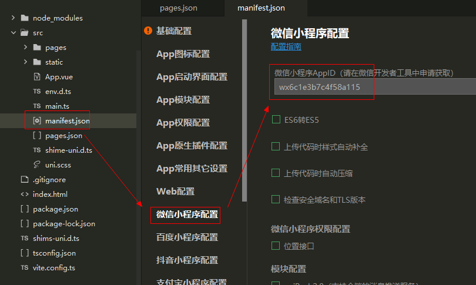
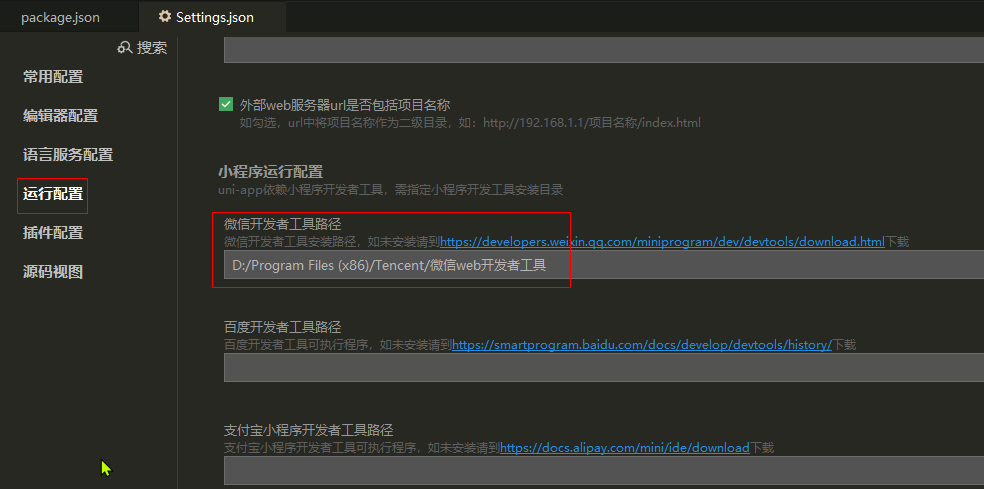
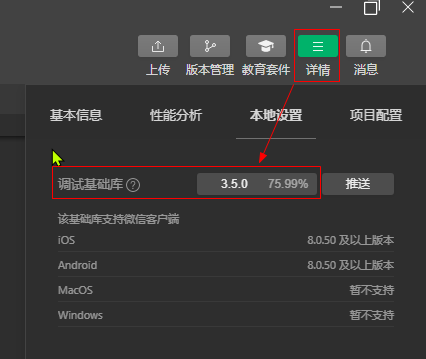
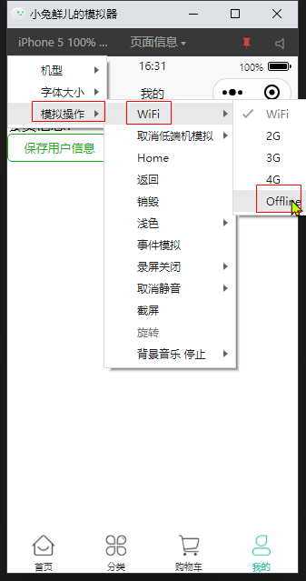
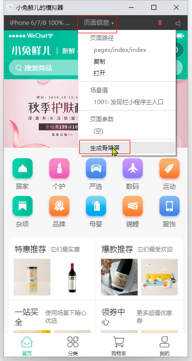
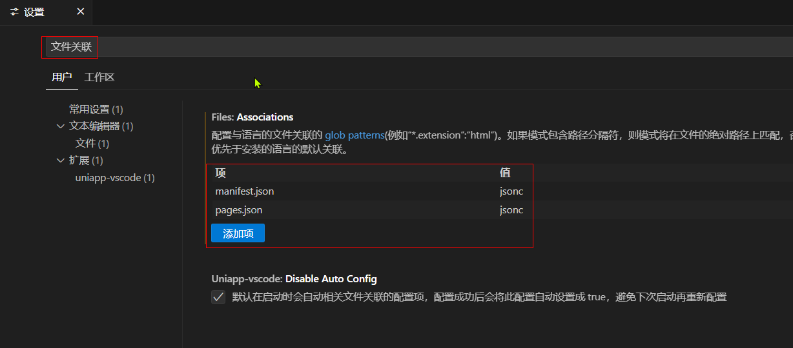

# uni-app 基础


## 1、HBuilderX 创建 uni-app 项目

### HBuildX

#### manifest.json



#### 小程序运行配置

工具 -> 设置 -> 运行配置 -> 微信开发者工具路径



> [!INFO]
>
> 如果改动代码后，模拟器没有更新，则关闭模拟器，重新云心


## 2、微信开发者工具

### 服务端口

设置 -> 安全 -> 服务端口


### 调试基础库




### 模拟网络错误



### 生成骨架屏



## 3、命令行创建 uni-app 项目

### 创建项目

Vite + Vue 3 + TypeScript

```bash
npx degit dcloudio/uni-preset-vue#vite-ts 项目名称
```


> [!INFO]
>
> 受版本的影响很大
>
> uni-app 锁定版本 3.0.0-alpha-3081220230802001
>
> Vue - Official 插件锁定版本 1.8.27


### 运行项目

```bash
npm run dev:mp-weixin
```

运行之后会提示：打开 微信开发者工具, 导入 dist\dev\mp-weixin 运行。


### 安装插件

**uni-create-view**

**uni-helper**

**uniapp小程序扩展**


### ts 类型校验

安装类型声明文件

```
npm i -D miniprogram-api-typings @uni-helper/uni-app-types
```

**tsconfig.json**

```js
{
  "compilerOptions": {
    "types": ["@dcloudio/types", "miniprogram-api-typings", "@uni-helper/uni-app-types"]
  },
  "vueCompilerOptions": {
    "nativeTags": ["block", "component", "template", "slot"]
  }
}
```


### json 注释问题

文件 -> 首选项 -> 设置，搜索：文件关联

添加 manifest.json 和 pages.json，值设置为 jsonc。允许在这2个 json 文件里写注释




## 4、路由配置

> [!INFO] 
>
> 修改页面配置后，要重新启动才能生效

### pages.json

#### pages

- pages节点的第一项为应用入口页（即首页）
- **应用中新增/减少页面**，都需要对 pages 数组进行修改
- 文件名**不需要写后缀**，框架会自动寻找路径下的页面资源


#### tabBar

- tabBar 中的 list 是一个数组，只能配置最少2个、最多5个 tab，tab 按数组的顺序排序。


### uni-ui

参考 [官方文档](https://zh.uniapp.dcloud.io/component/uniui/quickstart.html#npm%E5%AE%89%E8%A3%85)，使用 uni-ui 组件库


## 5、部署 h5

如果想要将 h5 应用部署到二级目录中，需要在`manifest.json`文件中配置相应的二级目录路径。

在`h5`节点下，设置`router`的`base`路径为二级目录名称。

```js
{
    "h5": {
        "router": {
            "base": "/uniapp-example/"
        }
    }
}
```

nginx 配置

```nginx
server {
  listen       80;
  server_name  localhost;
  
  location ^~ /uniapp-example {
    alias   html/uniapp-example/h5;
    try_files $uri $uri/ /index.html last;
  }
}
```

