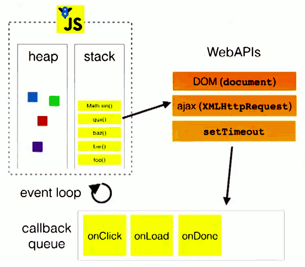

### 单线程

为什么 JavaScript 是一门单线程语言？作为一门浏览器脚本语言，它的主要用途就是操作DOM和与用户交互，如果说js是多线程的话，那么它在操作DOM的时候，一个线程对DOM进行了新增操作，另一个线程对DOM进行了删除操作，那么这个时候js的处理将会变得十分复杂。为了避免这种情况，JavaScript一诞生就是单线程。

### 任务队列

单线程就意味着，所有任务需要排队，前一个任务结束，才会执行后一个任务。如果前一个任务耗时很长，后一个任务就不得不一直等着。所有任务可以分成两种，一种是同步任务，另一种是异步任务。

**同步任务** 指的是，在主线程上排队执行的任务，只有前一个任务执行完毕，才能执行后一个任务；所有同步任务都在主线程上执行，形成一个执行栈;

**异步任务** 指的是，不进入主线程、而进入"任务队列"（task queue）的任务

**当主线程将执行栈中所有的代码执行完之后，主线程将会去查看任务队列是否有任务。如果有，那么主线程会依次执行那些任务队列中的回调函数。**

### 异步任务

JavaScript 的异步任务根据事件分类分为两种：宏任务（MacroTask）和微任务（MicroTask）

- **宏任务**：setTimeout、setInterval、requestAnimationFrame、requestIdleCallback、MessageChannel

  UI 渲染（HTML Parsing）、I/O 事件（Mouse Events、Keyboard Events、Network Events）、setImmediate（Node.js）

- **微任务**：Promise.then（非 new Promise）、MutationObserver、process.nextTick（Node.js）

**宏任务与微任务的优先级**

- 宏任务的优先级高于微任务
- 每个宏任务执行完毕后都必须将当前的微任务队列清空

### **事件循环**

主线程从"任务队列"中读取任务，这个过程是循环不断的，所以整个的这种运行机制又称为**Event Loop（事件循环）。**

主线程运行时候，产生堆（Heap）和栈（Stack），栈中的代码调用各种外部 API，它们在任务队列中加入各种事件。只要栈中的代码执行完毕，主线程就会通过事件循环机制读取任务队列，依次执行那些事件所对应的回调函数。

