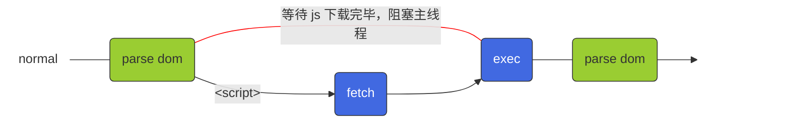
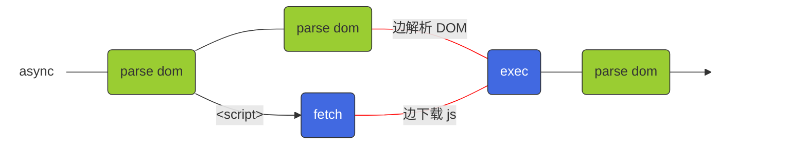
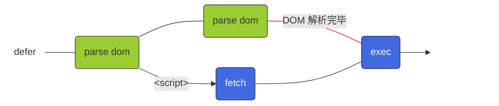

## 资源提示符

### script

-  `<script>` 没有资源提示符时，浏览器会等待 js 下载完毕后，执行 js，然后再解析 DOM

- `<script async />` 有 **async** 资源提示符时，浏览器会边解析 DOM ，边下载 js。当 js 下载完毕，就执行 js。此时 DOM 可能还没有解析完毕

- `<script defer />` 有 **defer** 资源提示符时，浏览器会边解析 DOM，边下载 js。当 DOM 解析完毕，才执行 js。

### link

- `<link rel="preload" />` 有 **preload** 资源提示符时

边解析 DOM，边下载资源。下载完毕后缓存起来，需要用到资源时，读取缓存

preload  优先级更高，下载当前页面需要的资源

- `<link ref="prefetch" />` 有 **prefetch** 资源提示符时

prefetch 优先级更低，下载其他页面需要的资源

