# React Hooks

**React Hooks 的意思是，组件尽量写成纯函数，如果需要外部功能和副作用，就用钩子把外部代码"钩"进来。** React Hooks 就是那些钩子。


## React / Vue 3 对照表

生成代码图片的网站 <strong> [Ray.so](https://ray.so/ "")</strong>

|                                                      | React Hooks                                                  | Vue3 组合式API                                               |
| ---------------------------------------------------- | ------------------------------------------------------------ | ------------------------------------------------------------ |
| <div style="white-space: nowrap;">状态钩子</div>     | 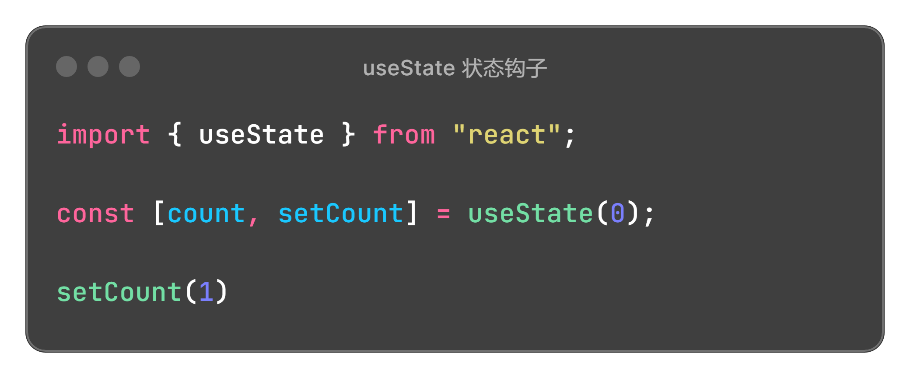 | 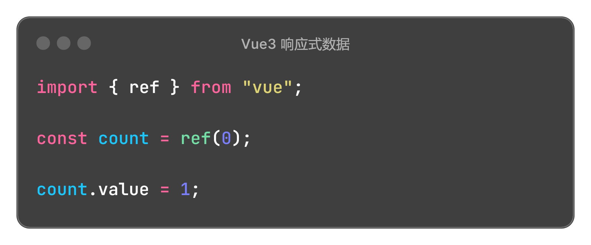 |
| <div style="white-space: nowrap;">副作用钩子</div>   | 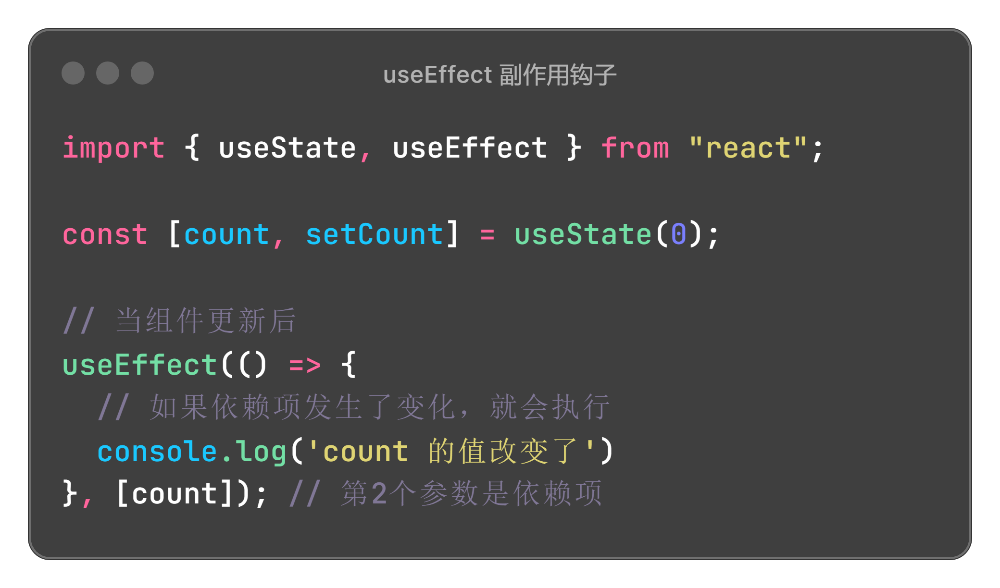 |  |
| <div style="white-space: nowrap;">生命周期</div>     | 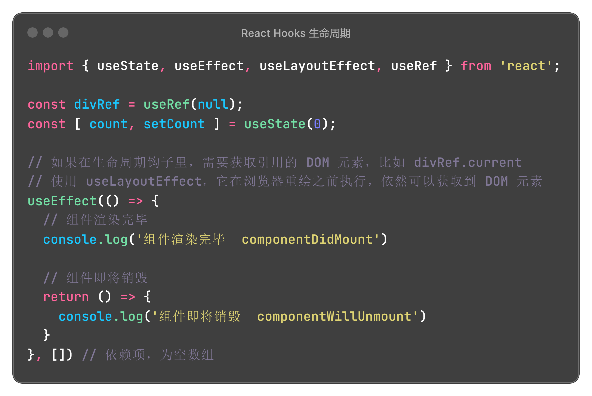<div>如果要获取引用的 DOM 元素，使用 **useLayoutEffect**</div> | 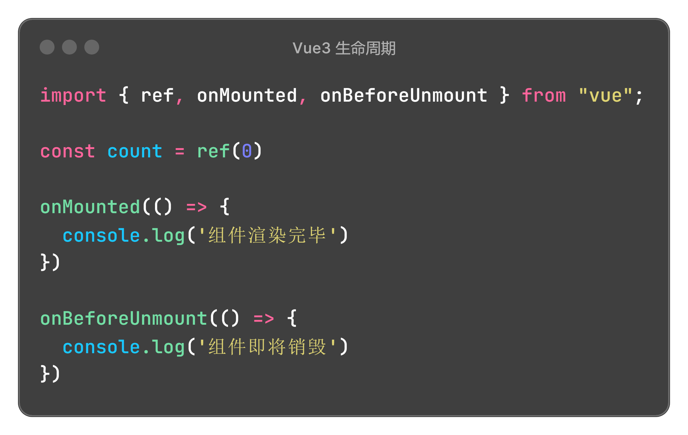 |
| <div style="white-space: nowrap;">引用子组件</div>   | 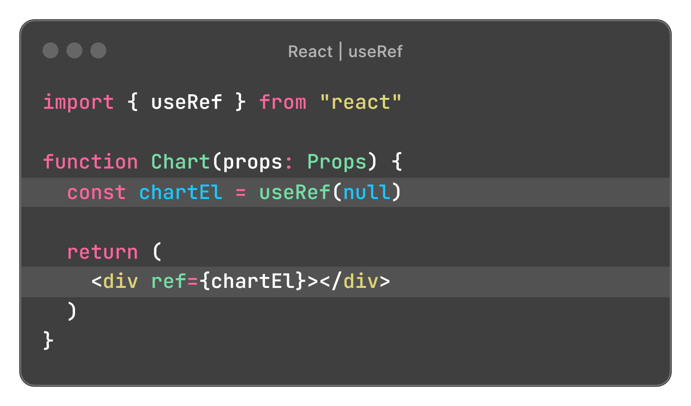 | 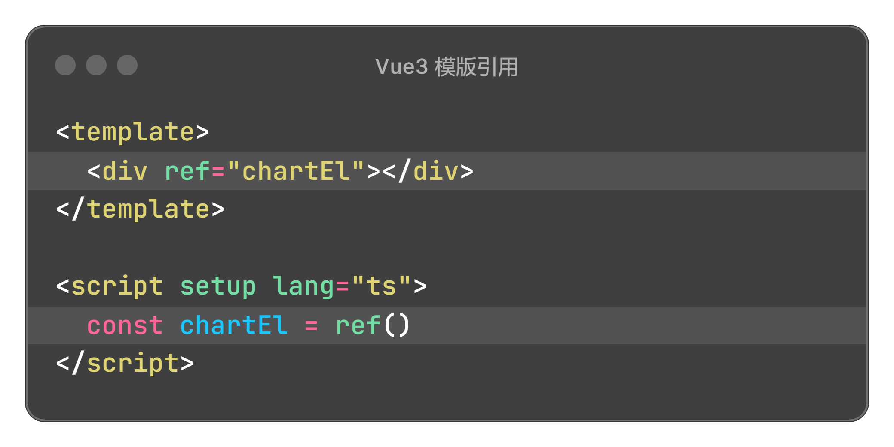 |
| <div style="white-space: nowrap;">组件暴露方法</div> | 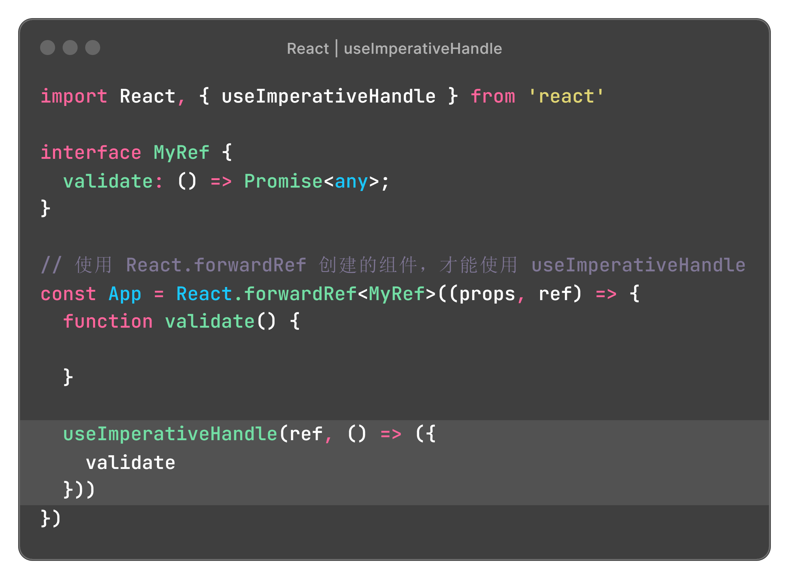 | 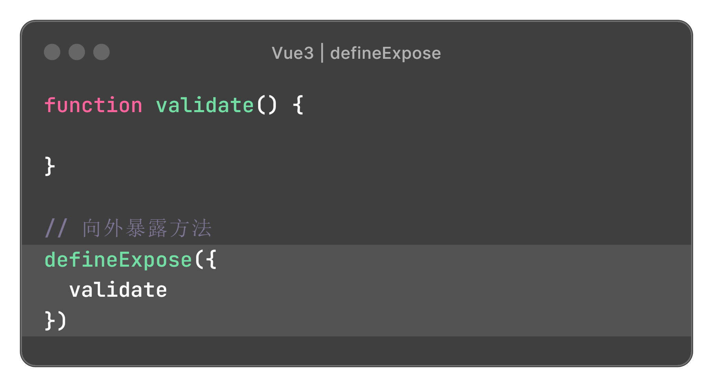 |
| 插槽 slot                                            | 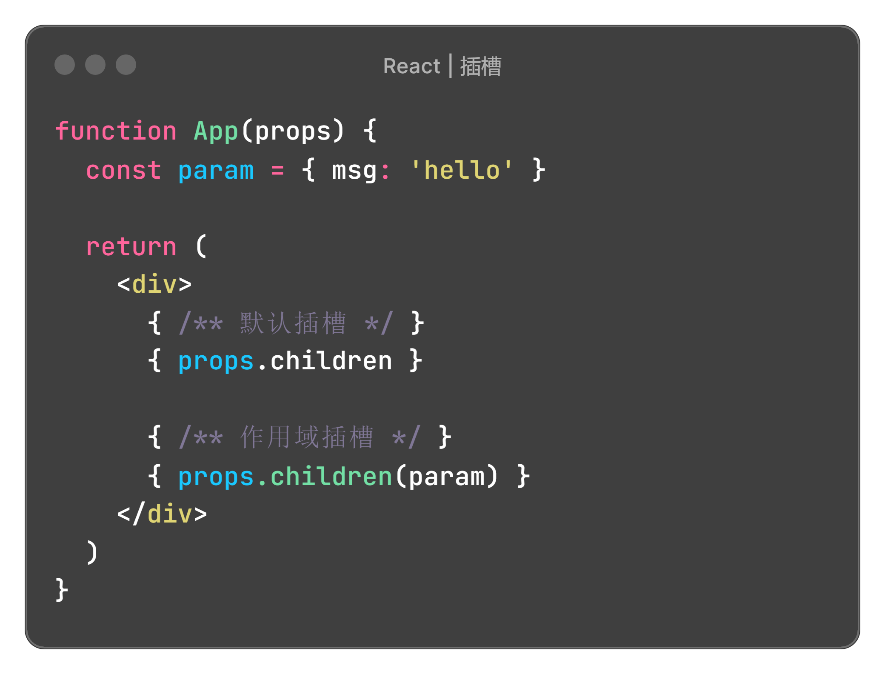 | 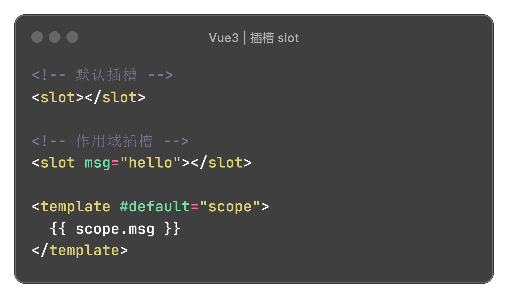 |
| 双向绑定                                             | 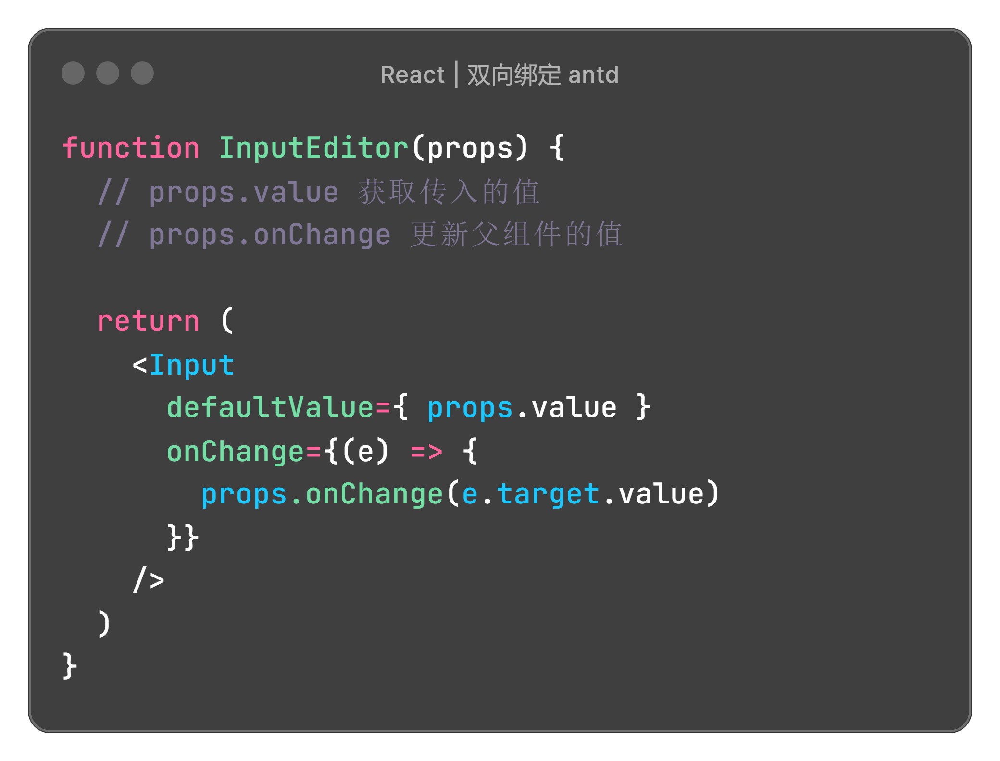 | 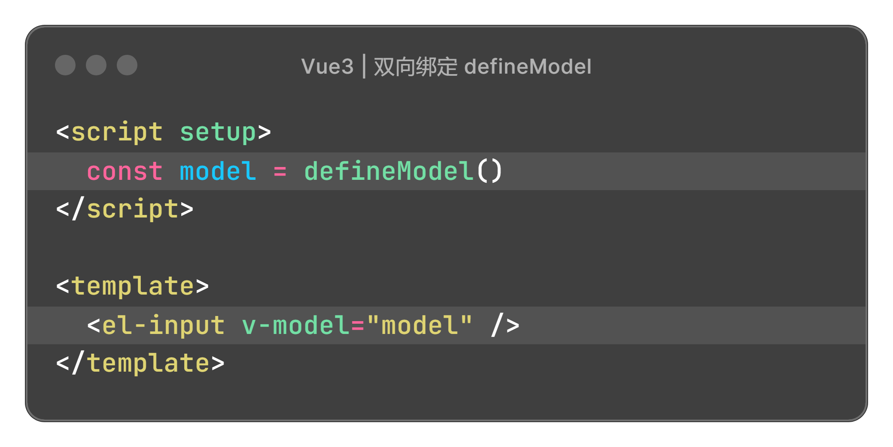 |


### 参考代码

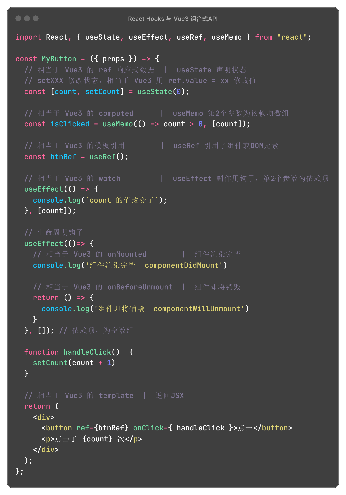

```javascript
import React, { useState, useEffect, useRef, useMemo } from "react";

const MyButton = ({ props }) => {
  // 相当于 Vue3 的 ref 响应式数据  |  useState 声明状态  |  setXXX 修改状态，相当于 Vue3 用 ref.value 修改值
  const [count, setCount] = useState(0);
  
  // 相当于 Vue3 的 computed      |  useMemo 第2个参数为依赖项数组
  const isClicked = useMemo(() => count > 0, [count]);
  
  // 相当于 Vue3 的模板引用        |  useRef 引用子组件或DOM元素
  const btnRef = useRef();
  
  // 相当于 Vue3 的 watch         |  useEffect 副作用钩子，第2个参数为依赖项
  useEffect(() => {
    console.log(`count 的值改变了`);
  }, [count]);
  
  // 生命周期钩子
  useEffect(()=> {
    // 相当于 Vue3 的 onMounted        |  组件渲染完毕
    console.log('组件渲染完毕  componentDidMount')
    
    // 相当于 Vue3 的 onBeforeUnmount  |  组件即将销毁
    return () => {
      console.log('组件即将销毁  componentWillUnmount')
    }
  }, []); // 依赖项，为空数组
  
  function handleClick()  {
    setCount(count + 1)
  }
  
  // 相当于 Vue3 的 template  |  返回JSX
  return (
    <div>
      <button ref={btnRef} onClick={ handleClick }>点击</button>
      <p>点击了 {count} 次</p>
    </div>
  );
};
```


## 动态组件

### 定义动态组件

**index.ts**

```js
export {default as StepItem1} from './StepItem1'
export {default as StepItem2} from './StepItem2'
export {default as StepItem3} from './StepItem3'
```

**StepItem.tsx**

```js
import * as StepItems from './index'

function StepItem(props) {
  const Step = StepItems[props.name]
  return <Step {...props} />
}
```

### 使用动态组件

```js
import StepItem from './StepItem'

function App() {
  const name = 'StepItem1'
  
  return <StepItem name={name} />
}
```


## 常用 Hooks

| React 自带 Hooks     |                                                              |
| -------------------- | ------------------------------------------------------------ |
| useState             | 状态钩子，在组件里添加状态                                   |
| useEffect            | 副作用钩子，用来添加生命周期钩子                             |
| useRef               | 保存DOM节点                                                  |
| useCallback          | 缓存函数定义，传给子组件时使用                               |
| useMemo              | 缓存计算结果，比如需要重新调用接口来获取的结果               |
| useLayoutEffect      | 在浏览器重新绘制屏幕前执行，需要获取DOM元素时使用            |
| useContext           | 从祖先元素接收信息                                           |
| **Redux 相关 Hooks** |                                                              |
| useSelector                     | 使用一个 selector 函数从 Redux store 的 `state` 中提取数据 |
| useDispatch                     | 返回一个 Redux store 中的 `dispatch` 函数 |


## 跨层级通信 Context

**context.ts**

```js
import React from 'react'

let defaultValue: any;
export const MyContext = React.createContext(defaultValue);
export const MyProvider = MyContext.Provider;
```

**在父组件里，提供数据**

```js
import { MyContext } from '@/utils/context';

function App() {
  const [value, setValue] = useState('')

  return (
    <MyProvider value={value}>
    
    </MyProvider>
  )
}
```

**在子组件里，消费数据**

使用 `useContext` 获取 context 提供的 value

```js
import { MyContext } from '@/utils/context';

function Child() {
  const str = useContext(MyContext)
}
```


## JSX 注释

{ /** 像这样写注释 */ }

```js
function App() {
  return (
    <Form form={form} onFinish={onSubmit} {...layout}>
      { /** blur 时触发校验，validateTrigger='onBlur' */ }
      <Form.Item name="name" label="活动名称" rules={rules.name} validateTrigger='onBlur'>
        <Input />
      </Form.Item>
    </Form>
  )
}
```


## 样式引用

### css module

**xxx.module.less**

通过 `:global()` 来覆盖全局样式

```css
.my-class {
  :global(.ant-steps-item-description) {
    white-space: nowrap !important;
  }
}
```

**在组件里使用**

通过 `import` 导入样式，通过 styles 获取 class

```js
import styles from './xxx.module.less'

function App() {
  return (
    <div className={styles['my-class']}>
    
    </div>
  )
}
```


### 全局样式

通过 `import` 导入样式

```js
import './xxx.less'
```


## 图片引用

### assets 目录下的图片

用 `import` 导入

```js
import logo from '@/assets/logo.svg'

function App() {
  return (
    
  )
}
```

### public 目录下的图片

用 public 下的相对路径。如果项目有 basePath，要在前面添加 basePath

```js
const basePath = '/demo/';

function App() {
  return (
    <div>
      
      
    </div>
  )
}
```


## React Fiber

### 工作原理

#### 任务切片

Fiber 的异步渲染是通过任务切片实现的。任务切片将渲染过程分解为多个小步骤，这样在执行过程中可以插入高优先级任务，如用户输入或动画。

#### Fiber 节点

在 Fiber 架构中，每个组件对应一个 Fiber 节点。这些 Fiber 节点构成了一个链表结构，每个节点都包含了该组件的状态、更新队列以及指向子组件、兄弟组件和父组件的指针。通过这种结构，React 可以灵活地遍历和操作组件树。

#### 双缓存机制

React Fiber 使用了一种双缓存机制，分别称为“current”和“workInProgress”。“current”表示当前屏幕上显示的 UI，而“workInProgress”表示正在构建的新 UI 树。当“workInProgress”构建完成后，它将替换“current”成为新的 UI 树。这种机制确保了 UI 的一致性和稳定性。
