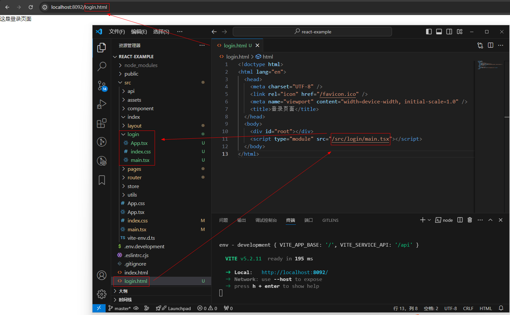

# 打包部署

## 多入口配置

### 入口 html

在根目录新增入口 html，加载不同的 main.ts

如果把登录页面作为独立的入口，则访问 login.html 



### vite.config.ts

```js
import { defineConfig } from 'vite'
import vue from '@vitejs/plugin-vue'
import { resolve } from 'path'

export default defineConfig({
... 
  build: {
    rollupOptions: {
      input: {
        main: resolve(__dirname, 'index.html'),
        login: resolve(__dirname, 'login.html')
      }
    }
  }
...
}
```
