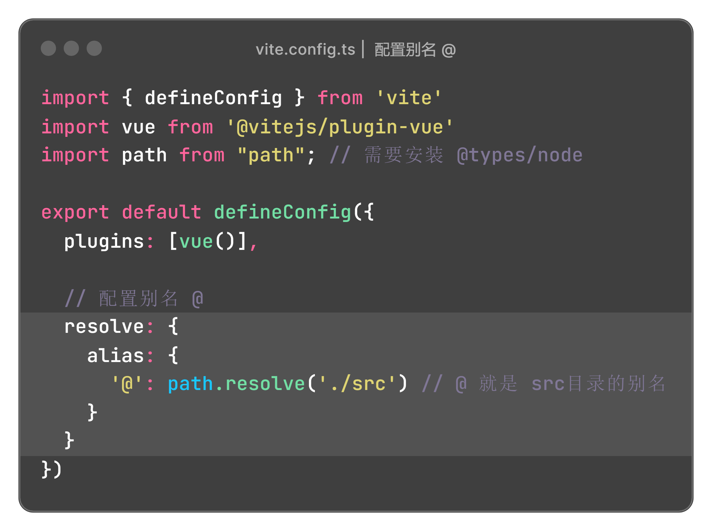
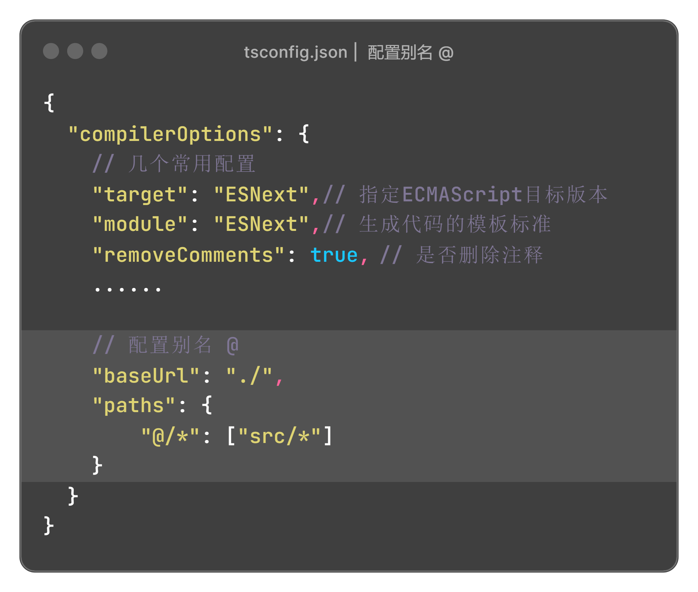

# 配置别名 @

## 安装 @types/node

```bash
npm install @types/node --save-dev
```

## vite.config.ts 配置别名

```js
// 配置别名 @
resolve: {
    alias: {
        '@': path.resolve('./src')
    }
}
```



## tsconfig.json 配置别名

```js
// 配置别名 @
"baseUrl": "./",
"paths": {
  "@/*": ["src/*"]
}
```

