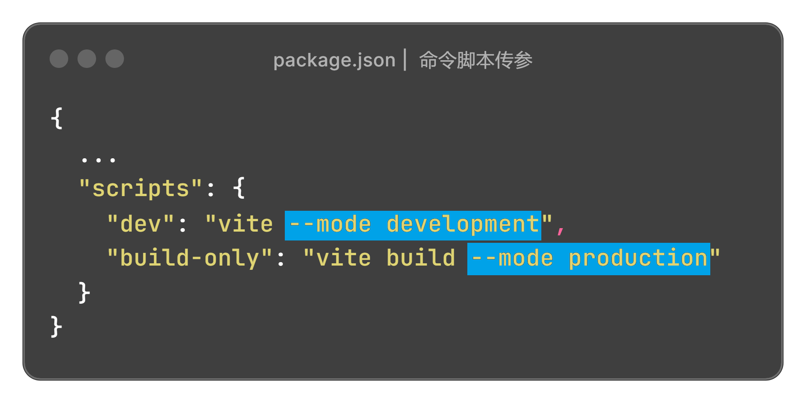

# 环境变量 .env

## 命令脚本传参

package.json

通过参数 **--mode**  指定读取哪个配置文件

```js
{
  ...
  "scripts": {
    "dev": "vite --mode development",
    "build-only": "vite build --mode production"
  }
}
```



## .env.development

开发环境配置信息

```properties
# 名称以 VITE_ 开头

# 前端访问时的项目名称，本地开发为根路径
VITE_APP_BASE=/

# 接口访问地址
VITE_SERVICE_API=/api
```


## 在代码中获取环境变量

```js
// 注意： import.meta.env 不能解构，要完整的取值
const VITE_APP_BASE = import.meta.env.VITE_APP_BASE
```
