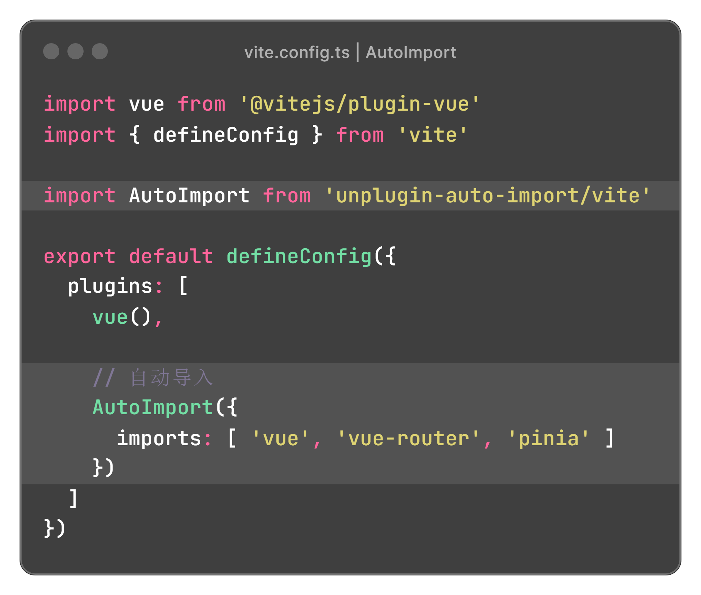
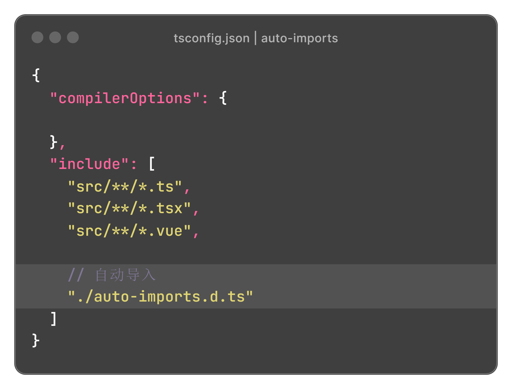

# 自动导入

使用 vite 编写 vue3 代码时，使用 composition api函数、Vue Router、pinia状态管理 等官方API需要在页面中显式引入。

而使用 unplugin-auto-import 插件可以自动导入这些API，从而提高开发效率，同时使代码更加简洁易读。


## 安装 unplugin-auto-import

```bash
npm i -D unplugin-auto-import
```


## 配置插件

**vite.config.ts**

```js
import vue from '@vitejs/plugin-vue'
import { defineConfig } from 'vite'

import AutoImport from 'unplugin-auto-import/vite'
 
export default defineConfig({
  plugins: [
    vue(),
    
    // 自动导入
    AutoImport({
      imports: [ 'vue', 'vue-router', 'pinia' ]
    })
  ]
})
```



## 使用插件

配置完成后，运行代码时会自动在根目录下生成一个auto-import.d.ts的文件。需要将该文件放入tsconfig.json中，插件才会生效：

tsconfig.json

```js
{
  "include": [
    "./auto-imports.d.ts"
  ]
}
```

