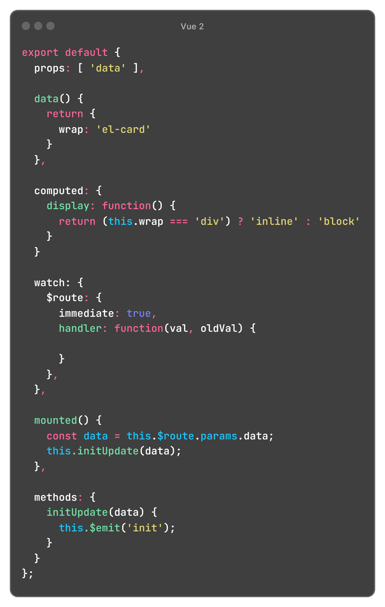
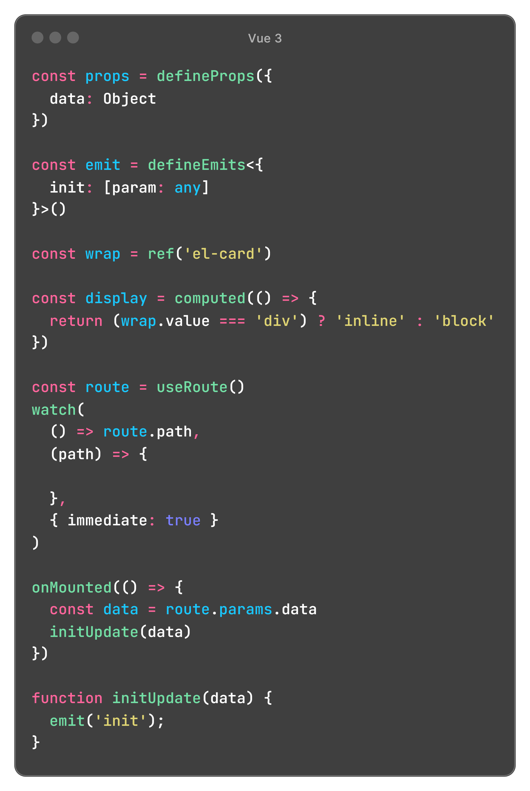

## 模板语法


<div class="full-width-table">

| 说明         | 属性                            | 备注                                              |
| ------------ | ------------------------------- | ------------------------------------------------- |
| 文本插值     | **{{ text }}**                  |                                                   |
|              | **{{ message \| capitalize }}** | 过滤器                                            |
| 绑定属性     | **:title**                      |                                                   |
| 监听事件     | **@click**                      |                                                   |
|              | **@submit.prevent**             | event.preventDefault()                            |
|              | **@click.stop.prevent**         | event.stopPropagation()<br>event.preventDefault() |
|              | **@keyup.enter.native**         | 只有在 `key` 是 `Enter` 时触发                    |
| 表单输入绑定 | **v-model**                     | 指令                                              |
| 条件渲染     | **v-if**                        |                                                   |
|              | **v-show**                      |                                                   |
| 列表渲染     | **v-for**                       | v-for="(item, index) in list"                     |

</div>

### 常用指令

| 指令                |                                                              |
| ------------------- | ------------------------------------------------------------ |
| v-show              | 不支持template语法<br>不管初始条件是什么，元素总是会被渲染，并且只是简单地基于 CSS 进行显示或隐藏的切换 |
| v-if                | 支持template语法<br>`v-if` 是“真正”的条件渲染，因为它会确保在切换过程中条件块内的事件监听器和子组件适当地被销毁和重建。<br>`v-if` 也是**惰性的**：如果在初始渲染时条件为假，则什么也不做——直到条件第一次变为真时，才会开始渲染条件块。 |
| 区别                | `v-if` 有更高的切换开销，而 `v-show` 有更高的初始渲染开销。<br>因此，如果需要非常频繁地切换，则使用 `v-show` 较好；如果在运行时条件很少改变，则使用 `v-if` 较好。 |
| v-else<br>v-else-if |                                                              |
| v-for               | key 唯一标识，vue 会基于 key 的变化重新排列元素顺序，并且会移除 key 不存在的元素。<br>有相同父元素的子元素必须有**独特的 key**。重复的 key 会造成渲染错误。 |
| v-html              | 渲染HTML标签                                                 |
| v-model             | 表单控件或者组件的双向绑定                                   |
| v-bind              | 绑定属性，缩写是 **：**                                      |
| v-on                | 绑定时间，缩写是 **@**                                       |
| v-slot              | 插槽名称，缩写是 **#**                                       |


### v-model 自定义组件

```js
一个组件上的 v-model 默认会利用名为 value 的 prop 和名为 input 的事件。
也可以使用 model 属性来配置 prop 名和事件名
```


## Vue 2 / Vue 3 对照表

|                                                  | Vue 2                                      | Vue 3                                      |
| ------------------------------------------------ | ------------------------------------------ | ------------------------------------------ |
| <div style="white-space: nowrap;">基本语法</div> |  |  |


## props / $emit

|       | 说明                                                         |
| ----- | ------------------------------------------------------------ |
| props | 子组件里定义的 **props**，可以接收父组件传进来的参数         |
| $emit | 子组件通过 **$emit** 函数，触发自定义事件，执行父组件上的方法 |

<br>

**父组件**

在 `components` 里注册组件 todo-item

`:title` 将 title 的值传给子组件

`@remove` 自定义事件 

```html
<template>
  <ul>
    <li
      is="todo-item"
      v-for="(todo, index) in todos"
      :key="todo.id"
      :title="todo.title"
      @remove="todos.splice(index, 1)"
    ></li>
  </ul> 
</template>

<script>
import TodoItem from '@/components/TodoItem.vue';

export default {
  components: {
    'todo-item': TodoItem
  }
}
</script>
```

<br>

**子组件**

在 `props` 里定义 title，接收父组件传入的值

通过 `$emit('remove')` 调用自定义事件

```html
<template>
  <li>
    {{ title }}
    <button @click="$emit('remove')">Remove</button>
  </li>
</template>

<script>
export default {
  props: {
    title: String
  }
}
</script>  
```

<br>

## 计算属性 computed / watch

计算属性 VS 方法

```js
计算属性有缓存，如果计算属性依赖的数据没有变化，则计算属性会返回之前的计算结果，不会执行函数。
而方法，在每次重新渲染时，都会再次执行函数
```

计算属性 VS watch

```js
当一些数据需要随着其它数据变动而变动时，使用`计算属性`

当需要在数据变化时执行异步操作或开销较大的操作时，使用`watch`
```


## 混入 mixin

```js
混入，混入对象可以包含任意组件选项。

选项合并：
1) 同名钩子函数将被合并到一个数组里
   先调用混入对象的钩子，再调用组件自身的钩子
2) 数据对象，methods、components 和 directives，将被合并
   如果键名冲突，则取组件的键值对
```


## $set

根据官方文档定义：**如果在实例创建之后添加新的属性到实例上，它不会触发视图更新**。

解决方法：使用 Vue.set(object, key, value) 方法将响应属性添加到嵌套的对象上，别名 $set

<br>

对象

```js
this.$set(Object, key, value)

// 有时你想向已有对象上添加一些属性，例如使用 Object.assign() 或 _.extend() 方法来添加属性。
// 但是，添加到对象上的新属性不会触发更新。
// 在这种情况下可以创建一个新的对象，让它包含原对象的属性和新的属性：
this.obj= Object.assign({}, this.obj, { a: 1, e: 2 })
```

数组

```js
this.$set(Array, index, newValue)
```


## 双向绑定原理 MVVM  - 待补充

`视图变化，更新数据` ---> 事件监听

`数据变化，更新视图` ---> 数据劫持 / 发布订阅模式


数据劫持

Object.defineProperty (obj, prop, descriptor) 

​    set  数据发生变化，通知所有订阅者

​    get  添加订阅者

