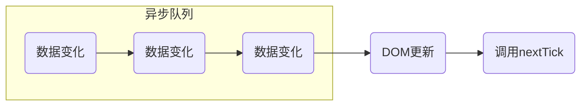
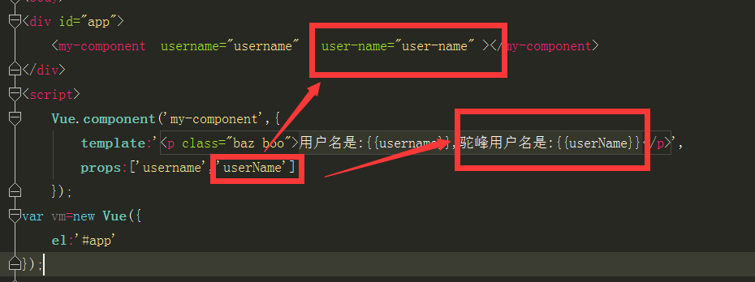

## 生命周期

| 生命周期  |               |
| --------- | ------------- |
| created   | beforeCreate  |
| mounted   | beforeMount   |
| updated   | beforeUpdate  |
| destoryed | beforeDestory |
| activated | deactivated   |


**updated**

只有 data 里的变量改变，并且要在页面重新渲染完成之后，才会进 updated 生命周期。 *只改变 data 里的值，但是没有在页面上渲染该值的话并不会触发 updated*

<br>

以如下代码为例，data 里定义了 text，且 text 的值需要渲染到页面上。当 text 的值发生变化时，就会进入 updated

如果去掉 div 标签，页面不渲染 text ，则无论 text 如何变化，都不会进入 updated

```html
<template>
  <div>{{ text }}</div>
</template>

<script>
export default {
  data() {
    return {
      text: '未更新'
    }
  }
}
</script>
```


## slot 插槽

 [官方文档](https://cn.vuejs.org/v2/guide/components-slots.html)，**Vue 实现了一套内容分发的 API，将 `<slot>` 元素作为承载分发内容的出口。**

当父组件需要向子组件内插入一些内容时，由 slot 分发负责这些内容在哪里显示。

<br>

比如子组件有2个具名插槽 `header`   `footer`

在父组件上使用 `slot="header"` 就可以将相应的内容插入到子组件的 `<slot name="header"></slot>` 插槽上

2.6.0 版本之后的新语法可以将 `slot="header"` 写作 `#header`

```jsx
// 父组件
<template>
  <div>
      <v-child>
          <p>hello</p>
          
          <!-- 
            2.6.0 之前版本的写法
            slot        插槽名称
            slot-scope  插槽作用于，可以获取到子组件插槽上绑定的属性
                        子组件的插槽上绑定了属性 text，通过 slot-scope 可以获取到 text
          -->
          <h3 slot="header">header</h3>
          <h3 slot="footer" slot-scope="scope">footer {{ scope.text }}</h3>
          
          <!-- 
            2.6.0 新版本的写法
            #插槽名称
            #插槽名称 = "scope"

            v-slot="scope"  向默认插槽传递作用于时，由于默认插槽没有名称，可以使用 v-slot 
          -->
          <h3 #header>header</h3>
          <h3 #footer="scope">footer {{ scope.text }}</h3>
          <h3 v-slot:footer="scope">footer {{ scope.text }}</h3>
      </v-child>
  </div>
</template>
```


```jsx
// 子组件
<template>
    <div>
        <h3>我是子组件</h3>
        <p>
            <slot name="header">父组件中没header的时候会显示</slot>
        </p>
        <p>
            <!-- 插槽 footer 上绑定了属性 text，可以提供给父组件使用 -->
            <slot name="footer" :text="text">父组件中没footer的时候会显示</slot>
        </p>
    </div>
</template>

<script>
export default {
  data() {
    return {
      text: 'zzz'
    }
  }
}
</script>
```


## 动态组件

需要动态显示多层级菜单时，可以自己封装一个递归组件来实现，即：在这个组件中使用自己

<br>

TreeMenu.vue  (子组件)

```html
<template>
  <!-- 使用 is 可以动态修改组件的类型 -->
  <div :is="type" :index="index">
    <template slot="title">
      <span>{{ item.text }}</span>
    </template>

    <template v-for="(obj, index) in item.children">
      <!-- 递归组件，使用自己 -->
      <ux-tree-menu :item="obj" :key="index"></ux-tree-menu>
    </template>
  </div>
</template>

<script>
export default {
  name: 'ux-tree-menu', // 在递归组件、keep-alive等场景下需要使用 name
  props: {
    item: Object
  },
  data() {
    return {
      type: '',
      index: ''
    }
  },
  created() {
    // 有子菜单就用 el-submenu，没有就用 el-menu-item
    this.type = this.item.children ? 'el-submenu' : 'el-menu-item';

    this.index = this.item.url ? this.item.url : this.item.text;
  }
}
</script>
```

<br>

父组件

```html
<template>
  <el-menu :default-active="$route.path" router>
  
    <template v-for="(item, index) in menu">
      <ux-tree-menu :item="item" :key="index"></ux-tree-menu>
    </template>
  
  </el-menu>
</template>

<script>
import TreeMenu from '@/components/TreeMenu.vue';

export default {
  components: {
    'ux-tree-menu': TreeMenu
  },
  data() {
    return {
      menu: [
        {
          text: '首页',
          url: '/'
        },
        {
          text: '入门 Demo',
          children: [
            {
              text: 'Vue 入门',
              url: '/demo/intro'
            },
            {
              text: 'Vuex 入门',
              url: '/demo/vuex'
            }
          ]
        }
      ]
    }
  }
}
</script>
```

### 透传属性

```html
<child v-bind="$attrs" v-on="$listener"></child>
```

## $nextTick

Vue 在**更新 DOM 时**是异步执行的。

只要侦听到数据变化，Vue 将开启一个队列，并缓冲在同一事件循环中发生的所有数据变更。

如果同一个 watcher 被多次触发，只会被推入到队列中一次。

在下一个的事件循环“tick”中，Vue 刷新队列并执行实际 (已去重的) 工作。




[官方文档](https://cn.vuejs.org/v2/api/index.html#vm-nextTick)，**this.$nextTick() 将回调延迟到下次 DOM 更新循环之后执行。在修改数据之后立即使用它，然后等待 DOM 更新。** 

*注：类似于 React 里的 `this.setState({}, () => { ... })` ，更新 state 里的数据，在 DOM 更新完毕后，执行自己的回调*

<br>

Vue 在更新 DOM 时是异步执行的：

也就是说数据变化后，DOM 不会马上更新，根据数据更新 DOM 的事件被放入<span style="color: red;">异步队列</span>/中

并且会进行 <span style="color: red; font-weight: bold;">去重</span> 处理，对同一个 DOM 节点的多次更新，会被去重，只执行一次

在这个更新 DOM 的队列结束后，就会调用 nextTick

<br>

例如：

```html
<template>
  <div @click="updateMessage">{{ message }}</div>
</template>

<script>
export default {
  data() {
    return {
      message: '未更新'
    }
  },
  methods: {
    updateMessage() {
      this.message = '已更新'

      console.log(this.$el.textContent) // => '未更新'
      
      this.$nextTick(() => {
        console.log(this.$el.textContent) // => '已更新'
      })
    }
  }
}
</script>
```

### 事件循环

运行机制：

1. 所有同步任务都在主线程上执行，形成一个 **执行栈**（Execution Context Stack）
2. 主线程之外，还存在一个 **任务队列**（Task Queue）。只要异步任务有了运行结果，就在 **任务队列** 之中放置一个事件
3. 一旦 **执行栈** 中的所有同步任务执行完毕，系统就会读取 **任务队列**，看看里面有哪些待执行事件。那些对应的异步任务，于是结束等待状态，进入执行栈，开始执行
4. 主线程不断重复上面的第三步


## 组件通信

### 父子组件通信

`props / $emit`

### 兄弟组件通信 eventBus

```js
const eventBus = new Vue();

// 触发事件
eventBus.$emit("eventName", param);

// 监听事件
eventBus.$on("eventName", param => {
    
});
```

### 全局状态管理 Vuex

`Vuex`

### 与后代组件通信 provide / inject

```js
{
  data() {
    return {
      name: '小松菜奈'
    }
  },
     
  // 在供给方组件内
  provide() {
    return {
      parentName: this.name
    }
  }
}
```

```js
{
  // 在注入方组件
  inject: ['parentName'],
}
```


## `<keep-alive>` 缓存组件

`<keep-alive>` 包裹动态组件时，会缓存不活动的组件实例，而不是销毁它们。

当组件在 `<keep-alive>` 内被切换，它的 `activated` 和 `deactivated` 这两个生命周期钩子函数将会被对应执行。


## 自定义指令

```js
V-Click-Outside
V-Clipboard
Vue-Lazyload

实现自定义的权限控制
```


## props

> [!ATTENTION]
>
> 子组件定义 props 时使用驼峰命名，父组件的模板上向子组件传值时，要改成短横线命名方式，因为 HTML 不区分大小写





> [!TIP]
>
> 如果子组件 watch props 监听不到，则参考如下代码，调整 watch 的写法

```js
prop: {
    action: {
        type: String,
        default: 'Add'
    }
},
watch: {
    action: {
        deep: true,
        immediate: true,    // 这句重要
        handler (val) {
            console.log('action Value:' + val);
        }
    }
}
```


## 虚拟DOM

虚拟 DOM `VNode`

