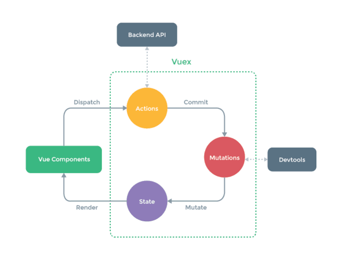

# 5. Vuex

安装

```bash
npm install --save vuex
```


## 5.1 流程图




## 5.2 分模块管理

### store / modules / user.js

**namespaced 命名空间**

当模块被注册后，它的state、mutation、action 及 getter 都会自动根据模块注册的路径调整命名。

```javascript
const state = {
  name: ''
}

const mutations = {
  SET_NAME: (state, name) => {
    state.name = name
  },
}

const actions = {
  setName({ commit, name }) {
    return new Promise((resolve, reject) => {
      commit('SET_NAME', name)
      resolve()
    })
  },
}

const getters = {
  upperName: state => {
    return state.name.toUpperCase()
  }
}

export default {
  namespaced: true,  // 开启命名空间
  state,
  mutations,
  actions,
  getters
}
```


### store / index.js
```javascript
import Vue from 'vue'
import Vuex from 'vuex'
import user from './modules/user'  // 导入模块

// 1) 要告诉 Vue 使用 Vuex
Vue.use(Vuex)

const store = new Vuex.Store({
 // 2) 添加模块
 modules: {
  user
 }
})

export default store
```


**main.js**

```javascript
import Vue from 'vue'
import App from './App.vue'

// 1) 引入store
import store from './store/index.js'

new Vue({
  store,  // 2) 将store注入到根实例中
  render: h => h(App)
})
```


## 5.3 基本使用方法

a) 获取属性

```javascript
this.$store.state.user.name
```

b) 调用action

```javascript
this.$store.dispatch("user/setName", name)
```

c) 调用mutation
```javascript
this.$store.commit('user/SET_NAME', name)
```

d) 获取getter属性

```javascript
this.$store.getters["user/upperName"]
```


## 5.4 辅助函数

导入辅助函数

```javascript
import {mapState, mapActions, mapMutations, mapGetters} from 'vuex'
```

**mapState**

```javascript
computed: {
  ...mapState('命名空间', [
    'name'
  ])
},
mounted() {
  console.log(this.name);
}
```

我们在mounted方法内，直接使用 this.xx 即可使用到对应computed中对应的属性了。

将 “命名空间” 改为 user

则 this.name 就映射到 this.$store.state.user.name 了 

**mapActions**

```javascript
methods: {
    testAction() {
        // 调用action
        Promise.all([this.setName('hi john')]).then((res) => {
        
      });
  },
  
  ...mapActions('命名空间', ['setName'])
}
```

我们methods里定义的方法中，直接使用 this.xx 即可调用 action。

将 “命名空间” 改为 user

则 this.setName() 就映射为 this.$store.dispatch('user/setName')

**mapMutations**

```javascript
methods: {
    testMutation() {
        // 调用mutation
        Promise.all([this.SET_NAME('kaizhou')]).then(() => {
          
        });
    },
    
    ...mapMutations('命名空间', ['SET_NAME'])
}
```

我们methods里定义的方法中，直接使用 this.xx 即可调用 mutation。

将 “命名空间” 改为 user

则 this.SET_NAME 映射成 this.$store.commit('user/SET_NAME') 

**mapGetters**

```javascript
computed: {
  ...mapGetters('命名空间', [
    'upperName'
  ])
},
mounted() {
  console.log(this.upperName);
}
```

我们在mounted方法内，直接使用 this.xx 即可使用到对应computed中对应的属性了。

将 “命名空间” 改为 user

则 this.upperName 就映射成 this.$store.getters["user/upperName"]

