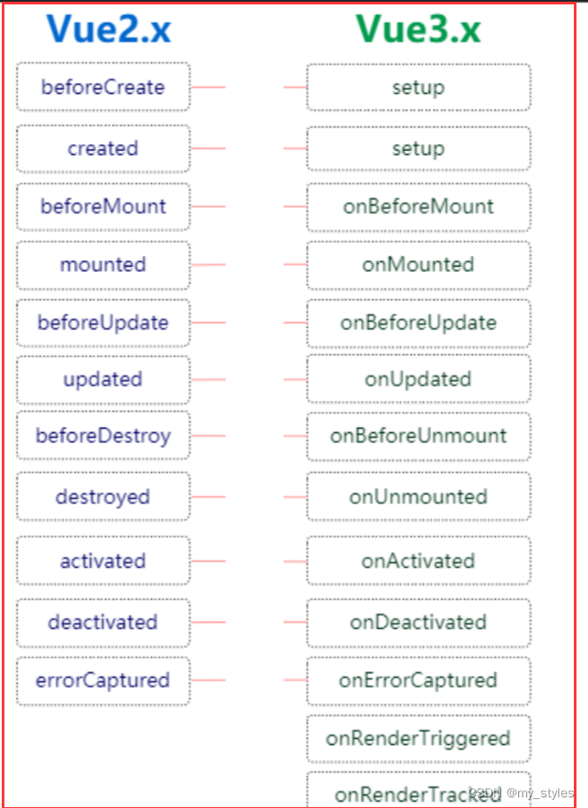

# 组件

## 1. 生命周期

| 生命周期      | 描述                               |
| :------------ | :--------------------------------- |
| beforeCreate  | 组件实例被创建之初                 |
| created       | 组件实例已经完全创建               |
| beforeMount   | 组件挂载之前                       |
| mounted       | 组件挂载到实例上去之后             |
| beforeUpdate  | 组件数据发生变化，更新之前         |
| updated       | 组件数据更新之后                   |
| beforeDestroy | 组件实例销毁之前                   |
| destroyed     | 组件实例销毁之后                   |
| activated     | keep-alive 缓存的组件激活时        |
| deactivated   | keep-alive 缓存的组件停用时调用    |
| errorCaptured | 捕获一个来自子孙组件的错误时被调用 |



## 2. nextTick 

作用：等待下一次 DOM 更新

实现原理：

- Vue 2：返回一个Promise，在下次DOM更新后，把这个Promise的状态变为resolved，如果有回调就执行回调函数
- Vue 3：在Promise.then里更新组件，当组件更新完毕后，返回的新Promise的状态才会发生变化

### 异步更新DOM

修改了数据以后，DOM更新不会同步执行，而是被缓存到一个队列里，在下次`tick`中一起执行。

这样是为了确保每个组件无论发生了多少次状态变化，都只会执行一次更新

### 事件循环

javascript是单线程的，在处理异步代码时，会创建异步任务，放到队列中


## 3 组件通信

### 父子组件通信

props / emit

### 兄弟组件通信 eventBus

**bus.ts**

```js
import mitt from 'mitt';
const bus = mitt();

export default bus;
```

使用

```js
import bus from '@/utils/bus';

// 触发事件
bus.emit('updateUser', val)

// 监听事件
bus.on('updateUser', (data: any) => {
    
})
```

### 全局状态管理 pinia

```js
import { defineStore } from 'pinia'

export const useCounterStore = defineStore('counter', () => {
  const count = ref(0)
  
  const doubleCount = computed(() => count.value * 2)
  
  function increment() {
    count.value++
  }

  return { count, doubleCount, increment }
})
```

### 与后代组件通信 provide / inject

```js
import { provide, ref } from 'vue'

const location = ref('North Pole')

function updateLocation() {
  location.value = 'South Pole'
}

// 在供给方组件内
provide('location', {
  location,
  updateLocation
})
```

```js
import { inject } from 'vue'

// 在注入方组件
const { location, updateLocation } = inject('location')
```


## 4 虚拟DOM
