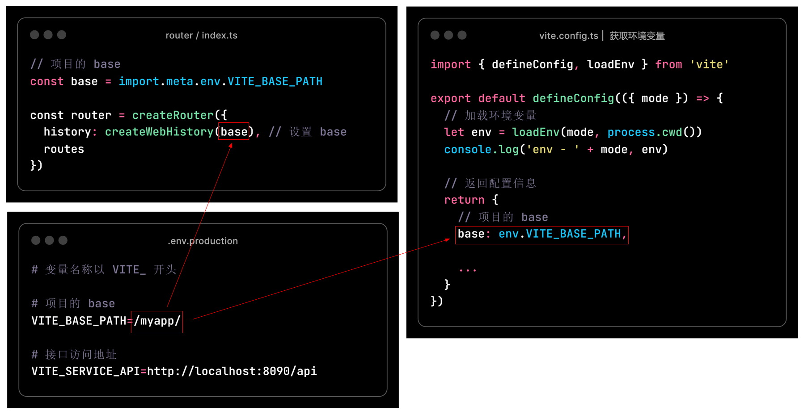

## 项目的 base

如果要部署在域名的二级目录，需要设置项目的 base

比如部署在 http://www.xx.com/myapp/ ，则 base 为 /myapp/




### a) 添加环境变量

**.env.production**

```properties
# 变量名称以 VITE_ 开头

# 项目的 base
VITE_BASE_PATH=/myapp/

# 接口访问地址
VITE_SERVICE_API=http://localhost:8090/api
```


### b) 修改 vite 配置

**vite.config.ts**  获取环境变量

```js
import { defineConfig, loadEnv } from 'vite'

export default defineConfig(({ mode }) => {
  // 加载环境变量
  let env = loadEnv(mode, process.cwd())
  console.log('env - ' + mode, env)

  // 返回配置信息
  return {
    // 项目的 base
    base: env.VITE_BASE_PATH, 
  }
})
```


### c) 修改路由配置

**route / index.ts**

```js
// 项目的 base
const base = import.meta.env.VITE_BASE_PATH

const router = createRouter({
  history: createWebHistory(base), // 设置 base
  routes
})
```