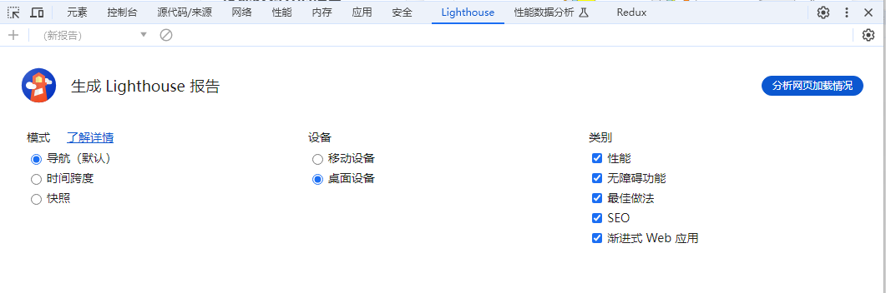

## Vite 打包优化


### 打包体积分析

安装插件 `rollup-plugin-visualizer`

```bash
npm i -D rollup-plugin-visualizer
```


**vite.config.ts**

添加配置

```js
plugins: [
  vue(),

  // 打包视图分析
  visualizer({
    open: true,
    emitFile: false,
    filename: 'stats.html',
    sourcemap: false,
  }),
],
```


**运行打包命令**，会自动打开分析结果


### 最小化拆分包

将需要分离的包，单独的打包出来

```js
build: {
  rollupOptions: {
    output: {
      // 拆分包
      manualChunks(id: any): string {
        if (id.includes("node_modules")) {
          return id.toString().split("node_modules/")[1].split("/")[0].toString();
        }
      }
    }
  }
}
```


### 配置项

```js
build: {
  // 关闭生成 sourcemap
  sourcemap: false,
  
  // 关闭文件计算
  reportCompressedSize: false,
}
```


## 如何测试网页性能？

使用 Chrome 的`Lighthouse`进行测试




参考文档

- [https://www.jb51.net/article/271663.htm](https://www.jb51.net/article/271663.htm)
