# 开发工具

## Node.js

### 配置镜像源 registry

```bash
# 查看镜像源
npm config get registry

# 设置镜像源
npm config set registry=https://registry.npmmirror.com/
```

配置文件存放在 **%USERPROFILE%** 下的 .npmrc


### 修改缓存路径

**1、查看默认配置路径**

```
npm config ls
```

cache：缓存模块

global：全局安装模块

**2、新建缓存文件夹**，不放在C盘，减少C盘的磁盘占用，比如

D:\node_modules\npm_cache

D:\node_modules\npm_global

**3、修改默认配置**

```bash
# 缓存模块
npm config set cache "D:\node_modules\npm_cache"

# 全局安装模块
npm config set prefix "D:\node_modules\npm_global"
```

**4、配置环境变量**

我的电脑 -> 右键 -> 属性，高级系统设置 -> 环境变量，在 Path 里，添加 global 路径

D:\node_modules\npm_global

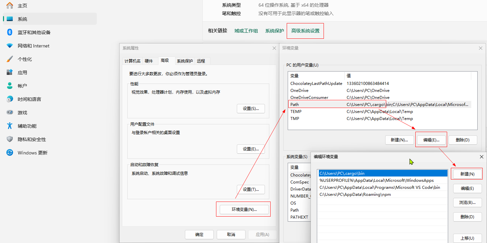


### pnpm

[基本使用教程](https://blog.csdn.net/m0_56416743/article/details/136122153)

安装

```bash
npm install -g pnpm
```

查看版本

```bash
npm -v
```

> 如果提示 “**pnpm不是内部或外部命令**”，则参考上一步，检查环境变量的配置

配置源

```bash
# 获取当前配置的镜像地址
pnpm config get registry

# 设置新的镜像地址
pnpm config set registry https://registry.npmmirror.com
```

修改官方默认的安装包安装路径位置

```bash
# 允许设置全局安装包的 bin 文件的目标目录。
pnpm config set global-bin-dir "D:\pnpm-store"

# 包元数据缓存的位置。
pnpm config set cache-dir "D:\pnpm-store\pnpm-cache"

# pnpm 创建的当前仅由更新检查器使用的 pnpm-state.json 文件的目录。
pnpm config set state-dir "D:\pnpm-store\pnpm-state"

# 指定储存全局依赖的目录。
pnpm config set global-dir "D:\pnpm-store\global"

# 所有包被保存在磁盘上的位置。
#（可选，以下这条命令可以选择不执行也是OK的）
pnpm config set store-dir "D:\pnpm-store\pnpm-store"
```

配置文件

> **C:\Users\用户名\AppData\Local\pnpm\config**

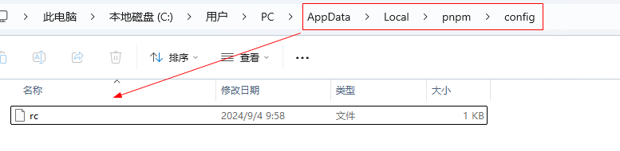

## Git

### 配置邮箱、账号、密码

TortoiseGit  -->  Settings 

- 填写工号、邮箱

- 编辑 .gitconfig，增加 [credential] 配置项，设置为保存用户名和密码


```
[user]
  name = 工号
  email = 邮箱
[credential]
    helper = store
```

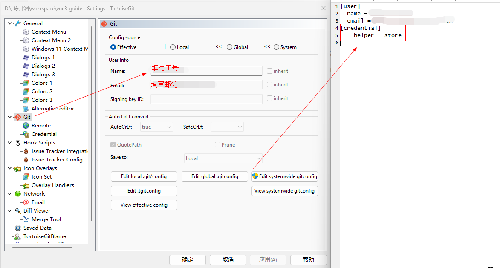

配置文件存放在 **%USERPROFILE%** 下的 .gitconfig

#### 不要忽略文件大小写

```bash
git config core.ignorecase false
```

#### 代码提交流程

- 在远程代码仓，基于开发分支，创建个人分支
- 本地拉取个人分支的代码【Git Clone】
- 每天及时 pull 拉取代码，保持本地代码和远程代码没有冲突
- 提交代码到个人分支 commit，并推送 push
- 在远程代码仓，创建合并请求，将个人分支的代码，合入开发分支，并找人检视代码
- 如果有代码冲突，将自己的代码文件单独备份，用 Beyond Compare 比较冲突，和开发分支保持一致后，再贴入自己的代码
- 检查流水线是否有异常，是否为自己合入的代码，导致的异常


## VSCode

### 以管理员身份运行

VSCode 桌面快捷方式，右键  -->  属性  -->  快捷方式  -->  高级  -->  以管理员身份运行

> 在命令行里执行某些命令时，需要有管理员身份。为了避免执行出错，用管理员身份运行VSCode

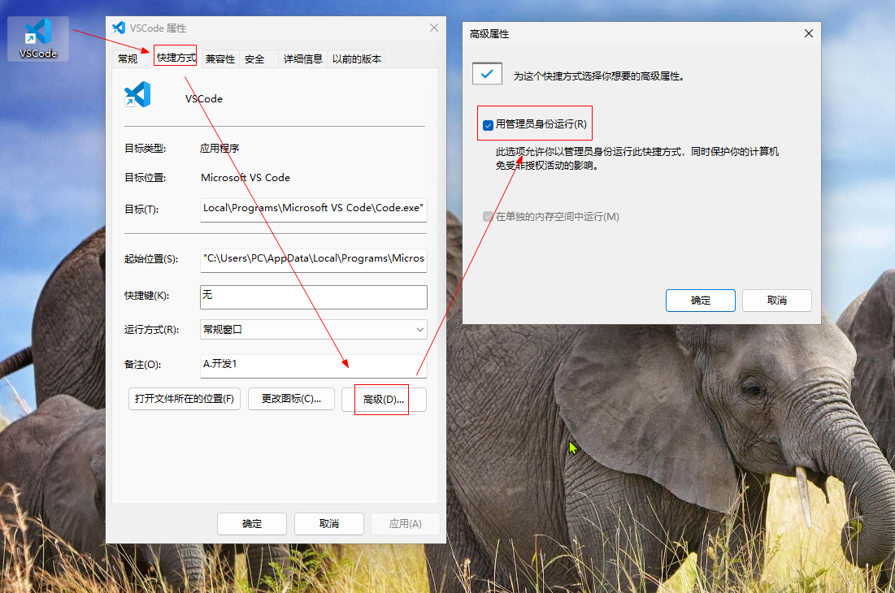

### 字体大小

文件  -->   首选项  -->  窗口  -->  Zoom Level 设置了 ***1***

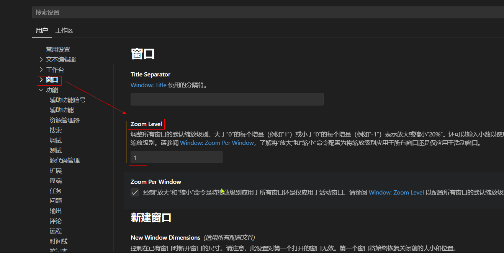

#### settings.json

文件  -->  首选项  -->  设置  -->  打开设置

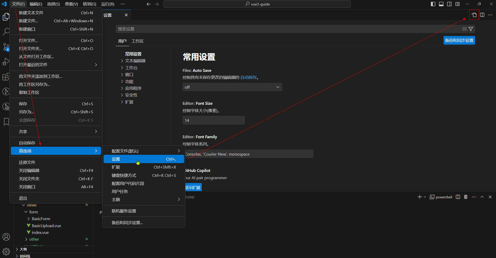


**常用插件**

| 名称                    |                    |
| ----------------------- | ------------------ |
| Vue - Official  (Volar) | Vue 3 语言支持     |
| Vue 3 VS Code Snippets  | Vue 3 常用代码片段 |
| GitLens                 | 查看代码修改记录   |
| ESLint                  | 代码规范检查       |

插件存放在  **%USERPROFILE%\.vscode\extensions**


**快捷键**

|                    | **快捷键**       | **说明**                                                  |
| ------------------ | ---------------- | --------------------------------------------------------- |
| **Windows 快捷键** | Win + D          | 切换到桌面                                                |
|                    | Win + L          | 锁定电脑                                                  |
| **VSCode 快捷键**  | Ctrl + `         | 显示 / 隐藏 <span style="color: tomato">终端</span>       |
|                    | Ctrl + B         | 显示 / 隐藏 <span style="color: tomato">左侧目录栏</span> |
|                    | Ctrl + P         | 打开文件                                                  |
|                    | Ctrl + G         | 跳转到指定行                                              |
|                    | Ctrl + Shift + O | 跳转到指定函数                                            |

**搜索**

在指定的文件夹下搜索

在文件夹上，右键 -> 在文件夹中查找

<br>

**Emmet**

常用的 Emmet 语法

```js
table>tr*2>td*3
```

**代码片段**

Ctrl + Shift + P  -->  Configure User Snippets  -->  选择 javascript

javascript.json

```js
"Import Router": {
  "prefix": "import-route",
  "body": [
    "import { useRoute, useRouter } from 'vue-router'"
  ]
}
```


## Postman

在浏览器里安装如下扩展（开发者模式）：

**Postman-5.5.6** 

**Postman Interceptor-3.1.0** 

> 加载成功后两个程序会生成各自的ID
>
> 用 Postman Interceptor v3.1.0 的ID去修改 Postman v5.5.6 目录下两个文件 /js/requester.js 与 /js/runner.js 中 postman_interceptor_id 的值
>
> ID替换文件中【aicmkgpgakddgnaphhhpliifpcfhicfo】字符，或原来 postman_interceptor_id 的值，并重新加载两插件。


## Windows

### 控制面板

桌面，右键  -->  个性化  -->  主题  -->  桌面图标设置


### 查看端口占用

<kbd>Win</kbd> + <kbd>R</kbd>  -->  cmd ，打开命令行，执行如下的命令

- 查看端口的占用情况


```
netstat -ano|findstr "8080"
```

- 根据查到的进程id，杀掉进程

```
taskkill /f /pid "4707"
```


### Win11 右键菜单

恢复成以前的右键菜单

<kbd>Win</kbd> + <kbd>R</kbd>  -->  cmd ，打开命令行，执行如下的命令

```bash
reg add "HKCU\Software\Classes\CLSID\{86ca1aa0-34aa-4e8b-a509-50c905bae2a2}\InprocServer32" /f /ve
```

然后重启电脑


### WinRAR 右键菜单

如果 WinRAR 右键菜单不见了，按照如下步骤设置

<kbd>Win</kbd> + <kbd>R</kbd>  -->  winrar，在选项 -> 设置 里，勾选 `遗留关联菜单`

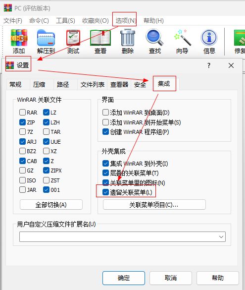


### Bing Wallpaper

图片存放在  **%USERPROFILE%\AppData\Local\Microsoft\BingWallpaperApp\WPImages** 


## 其他

### Nginx

#### 启动

<sup>[ [1](https://www.cnblogs.com/jiangwangxiang/p/8481661.html "参考资料") ]</sup> windows版本，下载地址：[ nginx/Windows-1.19.0](http://nginx.org/download/nginx-1.19.0.zip) 

下载后解压，路径不要包含中文

> [!ATTENTION]
> 使用windows版本的 nginx 启动时遇到(1113: No mapping for the Unicode character exists in the target multi-byte code page)这个错误<br>后来查阅资料发现是因为解压的路径里面包含有中文的缘故，只要把解压后的文件剪切到没有包含中文的目录即可解决问题

<br>

**1. 启动**

双击 nginx.exe，之后一个黑色的弹窗一闪而过

<br>

**检查 nginx 是否启动成功**

在浏览器里访问网址 http://localhost:80 ，出现如下页面说明启动成功

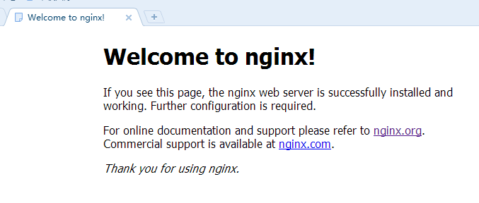

#### nginx.conf

nginx 的配置文件放在 conf / nginx.conf

> 在前端项目执行 build 打包后，将打包完成的 dist 文件夹，复制到 nginx 的 html 目录下，并修改如下配置

```nginx
location ^~ /vue3-guide {
  alias   html/dist;
  try_files $uri $uri/ /index.html;
}
```

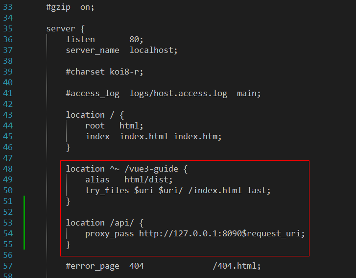


**1.更新配置**

当我们修改了nginx 的配置文件 nginx.conf 后，不需要重新启动 nginx，只需要在 nginx 的目录执行如下命令就可让改动生效

`nginx -s reload`


### PixPin

支持截图、贴图


### 搜狗输入法

**中文时使用中文标点**

输入法图标，右键 --> 更多设置 --> 常用 --> 中文时使用英文标点【取消勾选】


### Dawn Launcher

[下载地址](https://dawnlauncher.com/)

**1. 设置列数**

- 项目  -->  布局：列表  -->  列数：10
- 项目  -->  双击打开

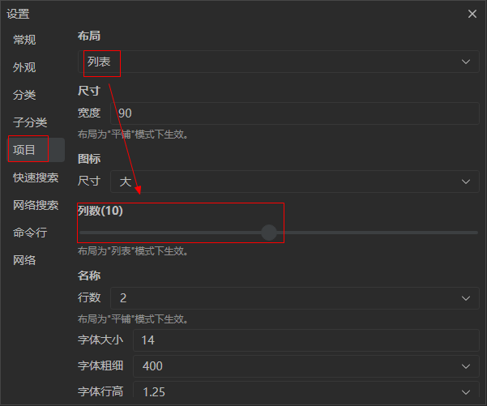

**2. 设置布局**

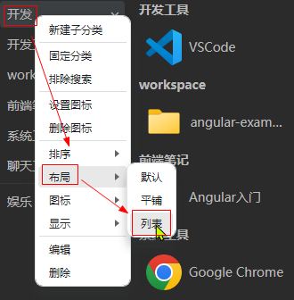

**3. 关联文件夹**

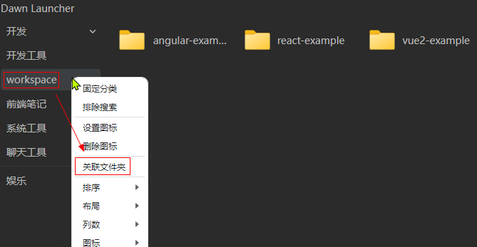


### 本地开发

**创建本地代码仓**

进入目录右键目录空白处选择"Git Create repository here...",弹出对话框点确认,这样即建立了一个本地Git仓库.

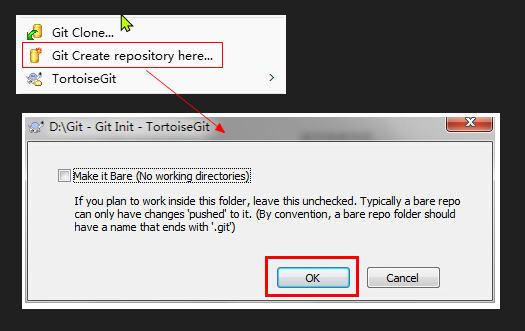