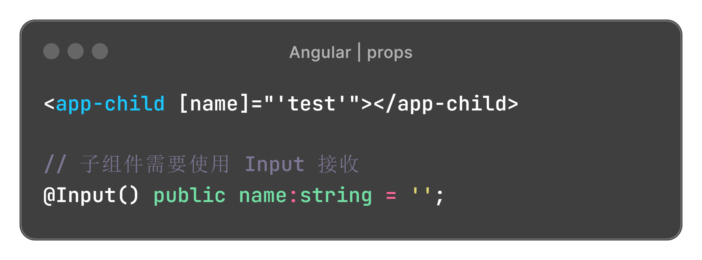
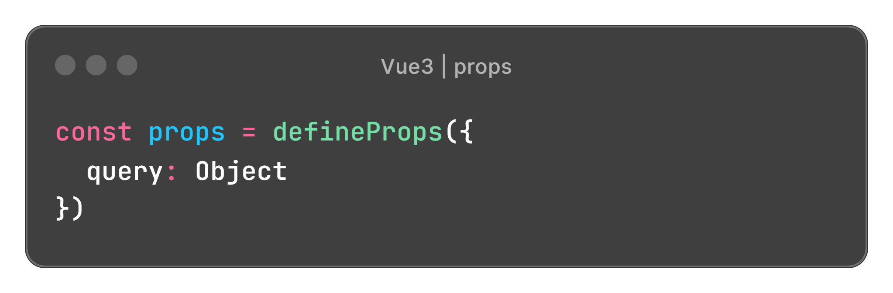
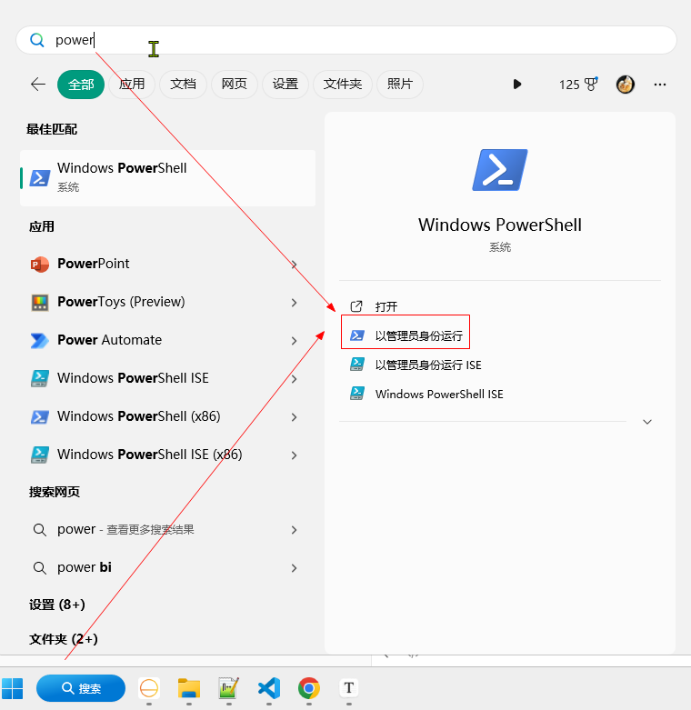
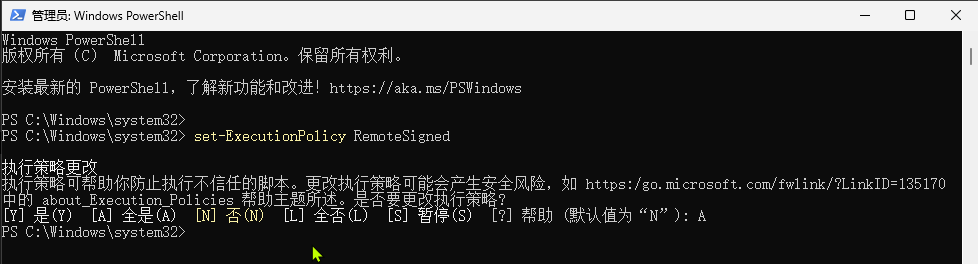

# Angular 笔记


## 开发环境搭建

Angular CLI 需要最新版本的node.js

```bash
# 安装 angular-cli
npm install -g @angular/cli

# 查看 angular 版本
ng version

# 创建项目，跳过测试
ng new 项目名称 --skip-tests

# 创建组件
ng g component 路径/组件名称 -m 模块名称 --standalone false

# 在 NgModule 的 declarations 里定义组件
# 也可能需要在 exports 里导出组件

# 创建其他
Directive    ng g directive my-new-directive
Service      ng g service my-new-service
Pipe      ng g pipe my-new-pipe

Interface    ng g interface my-new-interface
Class      ng g class my-new-class
Enum      ng g enum my-new-enum

# 启动运行 
ng serve

# 打包编译 
ng build 
```


### 配置别名 @

**tsconfig.json**

```js
"compilerOptions": {
    ...
    
  // 配置别名 @
  "baseUrl": "./",
  "paths": { 
    "@/*": ["src/*"] 
  }
},
```


### 配置代理

在项目根目录下建立文件：proxy.conf.json

```js
// 可以配置多个
{
  "/user/*": {
    "target": "http://localhost:3700",
    "secure": false,
    "logLevel": "debug",
    "changeOrigin": true
  },
  "/product/*": {
    "target": "http://localhost:3800",
    "secure": false,
    "logLevel": "debug"
  },
  "/settings/*": {
    "target": "http://localhost:3900",
    "secure": false,
    "logLevel": "debug"
  }
}
```


可以直接在启动命令上配置proxy-config

```bash
ng serve --proxy-config proxy.conf.json
```


第一种配置方法

package.json

```js
{
    "scripts": {
        "ng": "ng",
        "start": "ng serve --proxy-config proxy.conf.json", // 在这里配置proxy-config
        "build": "ng build",
        "test": "ng test",
        "lint": "ng lint",
        "e2e": "ng e2e"
    }
}
```


第二种配置方法

angular.json

```js
{
  "serve": {
     "builder": "@angular-devkit/build-angular:dev-server",
       
     // 在options里配置proxyConfig 
     "options": {
        "browserTarget": "api:build",
        "proxyConfig": "proxy.conf.json"
     },
     "configurations": {
        "production": {
           "browserTarget": "api:build:production"
        }
     }
  },
}
```


多代理入口，使用 **proxy.conf.js** 来代替 proxy.conf.json

```js
const PROXY_CONFIG = [
    {
        context: [
            "/my",
            "/many",
            "/endpoints",
            "/i",
            "/need",
            "/to",
            "/proxy"
        ],
        target: "http://localhost:3000",
        secure: false
    }
]
 
 
module.exports = PROXY_CONFIG;
```


### 配置路由

创建组件

```bash
ng g c 可以带路径/组件名称
```


路由配置

```js
import { RegexpPreviewComponent } from './tools/regexp-preview/regexp-preview.component'

const routes: Routes = [
  // 默认路由
  { path: '', redirectTo: '/regex', pathMatch: 'full' },

  // 路由懒加载
  { path: 'regex', component: RegexpPreviewComponent },
];
```


### 应用入口

angular.json

```js
"architect": {
  "build": {
    "options": {
       "index": "src/index.html",
       "main": "src/main.ts",  // 应用入口
    }
  }
}
```


main.ts

```js
// 根模块
import { AppModule } from './app/app.module';

platformBrowserDynamic().bootstrapModule(AppModule)
```


app.module.ts

```js
// 根组件
@NgModule({
  bootstrap: [AppComponent]
})
export class AppModule { }
```


app.component.ts

```js
@Component({
  selector: 'app-root', // 组件名称
})
export class AppComponent {
  title = 'angular-everyday';
}
```


index.html

```html
<body>
  <app-root></app-root>
</body>
```


## Angular 基础

### 模板语法

| 模板语法 | Angular                         | Vue                |
| -------- | ------------------------------- | ------------------ |
| 文本插值 | {{ message }}                   | {{ message }}      |
| 绑定属性 | [id]                            | :id 【即 v-bind】  |
| 绑定事件 | (click)                         | @click 【即 v-on】 |
| 双向绑定 | [(name)]                        | v-model            |
| **指令 Directive** |                                 |                    |
| 条件渲染 | *ngIf | |
| 列表渲染   | *ngFor="let item of list; let i=index" | v-for="item in list" |
| 其他 | ngClass | |
|  | ngStyle | |


### Angular / Vue 3 对照表

|                                                      | Angular                                                      | Vue 3 组合式API                                              |
| ---------------------------------------------------- | ------------------------------------------------------------ | ------------------------------------------------------------ |
| props                                                |  |  |
| emit                                                 |                                                              |                                                              |
| watch                                                |                                                              |                                                              |
| 生命周期                                             |                                                              |                                                              |
| 引用子组件                                           |                                                              |                                                              |
| <div style="white-space: nowrap;">组件暴露方法</div> |                                                              |                                                              |
| 插槽 slot                                            |                                                              |                                                              |
| 双向绑定                                             |                                                              |                                                              |


动态组件


### NgModule

 Angular v18 [参考文档](https://www.cnblogs.com/keatkeat/p/18010076)

- 创建 NgModule

  ```bash
  ng g module 模块名称
  ```

- 使用 NgModule

  **app.component.ts**

  ```js
  import { Component } from '@angular/core';
  import { RouterOutlet } from '@angular/router';
  
  import { ExampleModule } from './example/example.module'
  
  @Component({
    imports: [
      RouterOutlet,
      ExampleModule,
    ],
  })
  export class AppComponent {
    title = 'angular-example';
  }
  ```


### 组件通信

#### 父子组件通信

**父组件 向 子组件 传递数据 (Vue props)**

父组件

```html
<app-child [name]="'test'"></app-child>
```

子组件

```html
<span>{{name}}</span>
```

```typescript
// 子组件使用 Input 接收 props
@Input() public name:string = '';
```


**子组件 向 父组件 传递数据 (Vue emit)**

父组件

```html
<app-child (onChange)="handleChange($event)"></app-child>
```

子组件

```js
// 子组件使用 EventEmitter 创建自定义事件
@Output() public readonly onChange: EventEmitter<T> = new EventEmitter<T>();

this.onChange.emit(data);
```


**ViewChild 方法 (Vue ref)**

父组件

```html
<app-child #child></app-child>

<button (click)="print('hello')">点击</button>
```

```js
@ViewChild('child', { static: true })
public child!: ElementRef<HTMLElement>;

public print(content:string):void{
     if(this.child){
       // 这里得到child，可以使用child中的所有的public属性方法
       this.child.print(content);
     }
}
```


#### Subject 发布订阅

**Subject 发布订阅 (Vue eventBus)**

```js
// Service
import { BehaviorSubject } from 'rxjs';
...
public messageSource = new BehaviorSubject<string>('Start');
public changeMessage(message: string): void {
  this.messageSource.next(message);
}

public getMessageSource(): Observable<string> {
  return this.messageSource.asObservable();
}


// 发布
this.messageService.changeMessage('message change');


// 订阅 (记得根据需要选择是否取消订阅 unsubscribe)
this.messageService.getMessageSource().subscribe(m => {
  console.log(m);
})
```


#### Service 状态管理

**Service (pinia)**

Service 需要添加注解 @Injectable。Service是单例模式，可以简单的把 Service 当成 pinia 的 store 来使用

`service.ts`

```js
import { Component, Injectable, EventEmitter } from '@angular/core';

@Injectable()
export class myService {
  public info: string = '';
}
```


在组件里使用时，需要通过构造函数注入 service

```typescript
import { Service } from '../../service/service.service';

export class MyComponent {
    // 注入服务
    public constructor(
      public service: Service,
    ) { }

    public changeInfo():void {
      this.service.info = this.service.info + '1234';
    }
}
```


### 生命周期

| 生命周期                  | Angular                                                      | Vue 3           |
| ------------------------- | ------------------------------------------------------------ | --------------- |
| 初始化  (*处理请求数据*)  | ngOnInit (只调用一次)                                        |                 |
| 渲染完毕  (*处理DOM操作*) | ngAfterViewInit  (只调用一次)                                | onMounted       |
| 销毁                      | ngOnDestroy                                                  | onBeforeUnmount |
| 组件porps发生变化         | ngOnChanges  (组件的 @Input/@Output 绑定的值发生变化的时候会触发这个函数) | watch           |


## 常见问题

### ng 无法加载文件

- 管理员身份打开 PowerShell



- 修改权限

  执行如下命令，更改权限为 A

  ```bash
  set-ExecutionPolicy RemoteSigned
  ```

  
