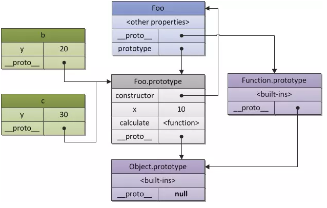

# Docsify


## 安装

```bash
npm i docsify-cli -g
```


## 初始化

在存放文档的目录里，执行 init 命令初始化，创建 docs 文件夹

```bash
docsify init ./docs
```

- docs 目录下的文件
  - index.html  入口文件
  - README.md  作为首页渲染


> [!ATTENTION]
>
> 文件夹下所有的目录、文件名都 <span style="color: red; font-weight: bold;">不要包含空格</span>，否则会导致如下的异常情况
>
> 1. 图片不能加载
> 2. 链接不能跳转 *( 如果链接里空格，需要转换成 %20 )*
> 3. 左侧的sidebar不能加载目录


## 本地预览文档

进入docs目录，运行本地服务器 `docsify serve`，然后在浏览器中打开 http://localhost:3000 即可。

> docsify serve


## index.html

### 本地资源

- 所有依赖的第三方库，都放在 `assets / lib` 目录下，成为本地资源，无需访问网络。在内网或者没有网络的环境，也可以使用。

- docsify 使用了 Google Fonts，所以也要下载到本地，并修改 docsify 的样式文件

  **vue.min.css**

```css
/* @import url("https://fonts.googleapis.com/css?family=Roboto+Mono|Source+Sans+Pro:300,400,600"); */
  
/* 使用本地 Google Fonts */
@import url("../../Google Fonts/Source Sans Pro.css");
```

  

### 侧边栏

在不同的目录，使用不同的侧边栏

```
- docs
  - get-start      (首页)
    - _sidebar.md  (首页的侧边栏)
    
  - JavaScript
    - _sidebar.md  (JavaScript目录，及其所有的子目录，都使用这个侧边栏)
  
  - Vue3
    - _sidebar.md  (Vue3目录，及其所有的子目录，都使用这个侧边栏)
```


解决方式

```js
window.$docsify = {
  ...
  
  // 不同的目录，使用不同的侧边栏
  alias: {
    '/docs/JavaScript(.*)/_sidebar.md': '/docs/JavaScript/_sidebar.md',
    '/docs/Vue3(.*)/_sidebar.md': '/docs/Vue3/_sidebar.md'
  }
}
```


### 图片

所有图片都使用相对路径，保证在本地可以正常查看。比如

```markdown

```

在页面渲染时，将图片上的相对路径都去掉，保证图片可以正常查看。比如

```html

```


解决方式

```js
window.$docsify = {
  ...
  
  // 解决图片加载的问题
  markdown: {
    renderer: {
      image: function(href, title) {
        const mediaPath = 'assets';
        
        const regex = new RegExp('^(.*)' + mediaPath);
        const path = href.replace(regex, mediaPath);
        return ``
      }
    }
  }
}
```


## 部署到 GitHub

配置 GitHub Pages，选择部署 main 分支


