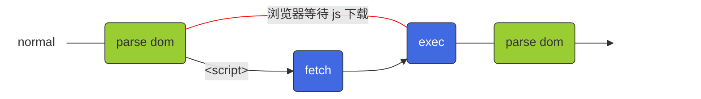
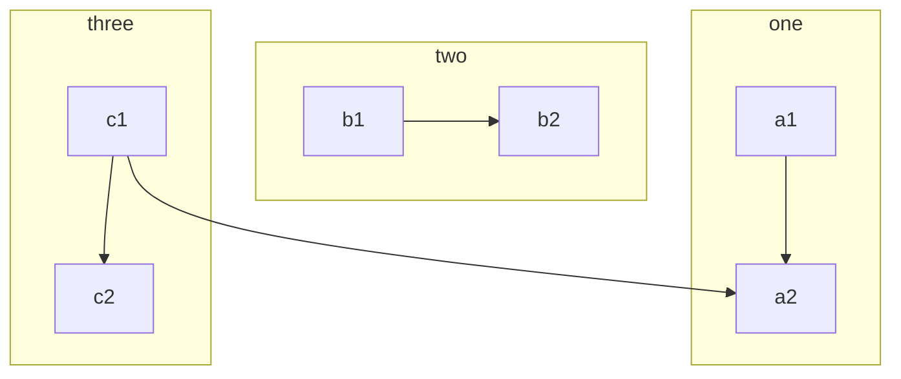
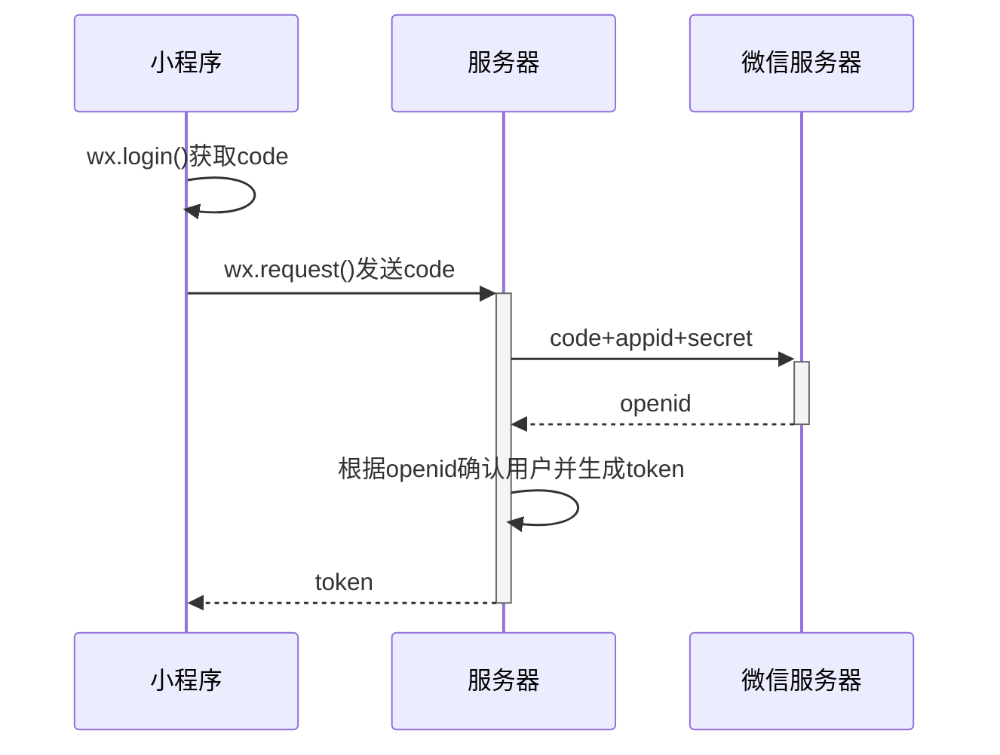
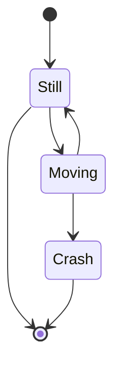
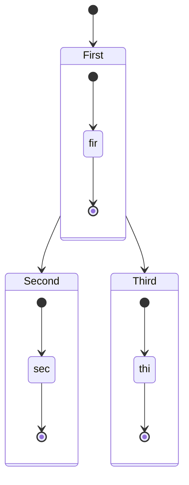

## Mermaid

### 流程图

```js
flowchart LR
  %% 注释使用 %% 开头
  %% 使用 classDef 定义样式
  %% 使用伪类，在节点上使用样式  :::start
  
  %% 定义节点
  start(normal):::start
  parse_1(parse dom):::green
  exec(exec):::blue
  parse_2(parse dom):::green
  fetch(fetch):::blue
  finish:::finish

  %% 设置节点关系
  start --- parse_1 -- "浏览器等待 js 下载" --- exec --- parse_2 --> finish
  parse_1 -- "&lt;script&gt;" --> fetch --> exec
  
  %% 使用 classDef 定义样式
  classDef start fill:none, stroke:none
  classDef finish fill:none, stroke:none, color:transparent
  classDef green fill:yellowgreen, stroke:#333, stroke-width:1px
  classDef blue fill:royalblue, stroke:#333, stroke-width:1px, color:white
  
  %% 使用 linkStyle 设置第 n 条连接线的样式
  linkStyle 1 stroke:red
```



子图

```js
graph TB
    c1-->a2
    subgraph one
    a1-->a2
    end
    subgraph two
    b1-->b2
    end
    subgraph three
    c1-->c2
    end
```



### 时序图

```js
sequenceDiagram
  小程序 ->> 小程序 : wx.login()获取code
  小程序 ->> + 服务器 : wx.request()发送code
  服务器 ->> + 微信服务器 : code+appid+secret
  微信服务器 -->> - 服务器 : openid
  服务器 ->> 服务器 : 根据openid确认用户并生成token
  服务器 -->> - 小程序 : token
```



### 状态图

```js
stateDiagram-v2
  [*] --> Still
  Still --> [*]
  
  Still --> Moving
  Moving --> Still
  Moving --> Crash
  Crash --> [*]
```



组合状态

```js
stateDiagram-v2
[*] --> First
First --> Second
First --> Third

state First {
    [*] --> fir
    fir --> [*]
}
state Second {
    [*] --> sec
    sec --> [*]
}
state Third {
    [*] --> thi
    thi --> [*]
}
```



备注

```js
// 将 mermaid 流程图缩小0.8倍
document.querySelectorAll('.mermaid').forEach(x => {x.style.zoom = '0.8'})
```
