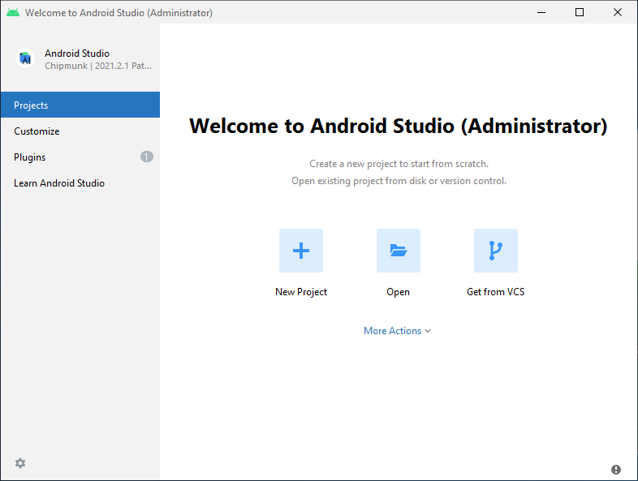

# React Native 笔记


## 准备文件夹

为了避免安装文件和缓存文件把 C 盘占满，在其他盘新建文件夹。文件夹名称 **只有英文字符**、**没有空格**

|  D:\Andriod  | Andriod 相关的都放在这里 |      |
| ---------- | ------------------------ | ---- |
| D:\Andriod \ **SDK** | Android SDK |      |
| D:\Andriod \ **.gradle** | gradle 的 home 目录 |      |
| D:\Andriod \ **.android** \ **avd** | Android 模拟器 |      |


### 配置环境变量

#### GRADLE_USER_HOME


#### ANDROID_HOME

`我的电脑` -> `属性` -> `高级系统设置` -> `高级` -> `环境变量` 

创建一个名为`ANDROID_HOME`的环境变量（系统或用户变量均可）

变量值为 `D:\Andriod\SDK`


#### Path

``我的电脑` -> `属性` -> `高级系统设置` -> `高级` -> `环境变量` 

选中**Path**变量，然后点击**编辑**，添加如下目录

```
%ANDROID_HOME%\platform-tools
%ANDROID_HOME%\emulator
%ANDROID_HOME%\tools
%ANDROID_HOME%\tools\bin
```


## 创建项目

项目所在的文件夹，必须 **只有英文字符**、**没有空格**

项目名称，必须 **只有英文字母和数字**、**没有空格**

```bash
npx react-native@latest init 项目名称
```


## 环境搭建

按照官方文档进行 [环境搭建](https://reactnative.cn/docs/0.73/environment-setup)

### JDK

安装 [JDK 17](https://adoptium.net/zh-CN/temurin/releases/?variant=openjdk17&jvmVariant=hotspot)


### Android 开发环境

#### Android Studio

1、安装 [Android Studio](https://developer.android.google.cn/studio?hl=zh-cn)

2、安装界面中选择"Custom"选项，选中以下几项：

- `Android SDK`
- `Android SDK Platform`
- `Android Virtual Device`

可以跳过这些，后面再安装



3、打开 React Native 项目的 android 文件夹


#### Android SDK

1、打开 SDK Manager

选择 Android SDK 所在的文件夹，比如  `D:\Andriod\SDK`


2、选择"SDK Platforms"选项卡，右下角勾选"Show Package Details"

展开`Android 13 (Tiramisu)`选项，勾选下面这些组件

- `Android SDK Platform 33`
- `Intel x86 Atom_64 System Image`（官方模拟器镜像文件，使用非官方模拟器不需要安装此组件）


3、点击"SDK Tools"选项卡，右下角勾选"Show Package Details"

展开"Android SDK Build-Tools"选项，勾选

- `33.0.0`版本


#### gradle 配置


### 使用 Android 模拟器

1、打开 Device Manager，点击"Create Virtual Device..."


2、选择**Tiramisu** API Level 33 image


#### 修改模拟器目录

- 运行模拟器，在正常开机，进入手机界面后，关闭 Android Studio
- 进入文件夹 `%USERPROFILE%\.android\avd` 


- 修改 .ini 里的配置，将 path 改到 `D:\Andriod\.android\avd` 目录下


- 将模拟器文件夹 xxx.avd ，移动到 `D:\Andriod\.android\avd` 目录下
- 打开 Android Studio，启动模拟器，检查是否能正常启动


## 运行项目

确保先运行了模拟器或者连接了真机，然后执行如下命令

```
npm run android
```


> [!ATTENTION]
>
> 不要轻易点击 Android Studio 中可能弹出的建议更新项目中某依赖项的建议，否则可能导致无法运行。
