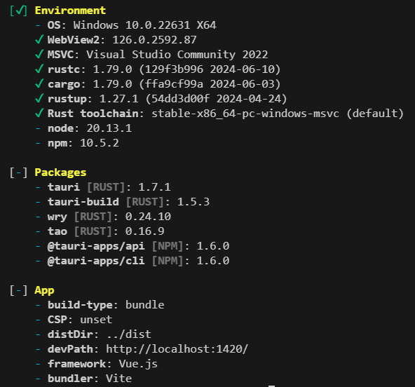

# Tauri 笔记


## 安装 Rust

在 [Rust](https://www.rust-lang.org/tools/install) 官方网站，下载安装包。根据安装步骤的提示，下载  Visual Studio、Windows 11 SDK 等依赖之后，安装 Rust。


### 查看 Rust 版本

```bash
rustc --version
```


## 搭建项目

### 创建新项目

```bash
npx create-tauri-app your-project-name
```

选择 TypeScript、Vue


### 启动 web 项目

```bash
npm run dev
```


### 启动 tauri 项目

```bash
npm run tauri dev
```

第一次启动项目时，tauri 会根据`src-tauri/Cargo.toml` 去下载相关依赖（导致第一次启动比较慢），第二次启动会快很多。


### 查看 tauri 环境信息

```bash
npm run tauri info
```




### 打包

**src-tauri / tauri.conf.json**

修改 tauri.conf.json 里的 identifier，改成自己的应用名称

```js
{
  "bundle": {
    "identifier": "com.tauri.dev",
  }
}
```


**执行打包命令**

```bash
npm run tauri build
```

构建完成后，可执行文件【无需安装，直接执行】、及应用程序安装包，在如下目录：

可执行文件，在 `src-tauri/target/release/` 目录下

安装包，在 `src-tauri/target/release/bundle/{platform}/{app}` 下


## 参考文档

- [Tauri 入门篇 - 创建项目](https://mp.weixin.qq.com/s?__biz=MzI1MjAzNDI1MA==&mid=2648216340&idx=4&sn=d44ba5343306f104f3ac04fa1ba61dcc&chksm=f1c5deb1c6b257a76689af6367c633b893ac8eee70a378eebe20fd1e3562cd133b07cbc4292c&scene=27)

