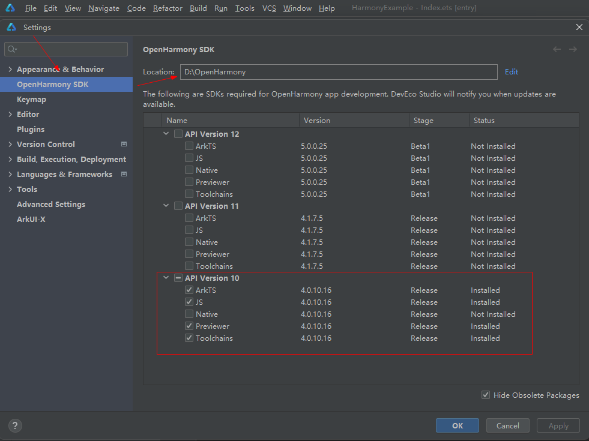
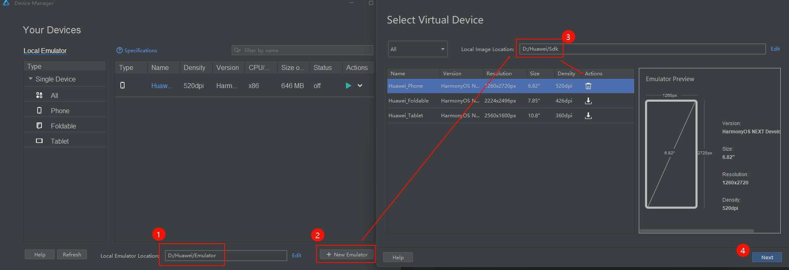
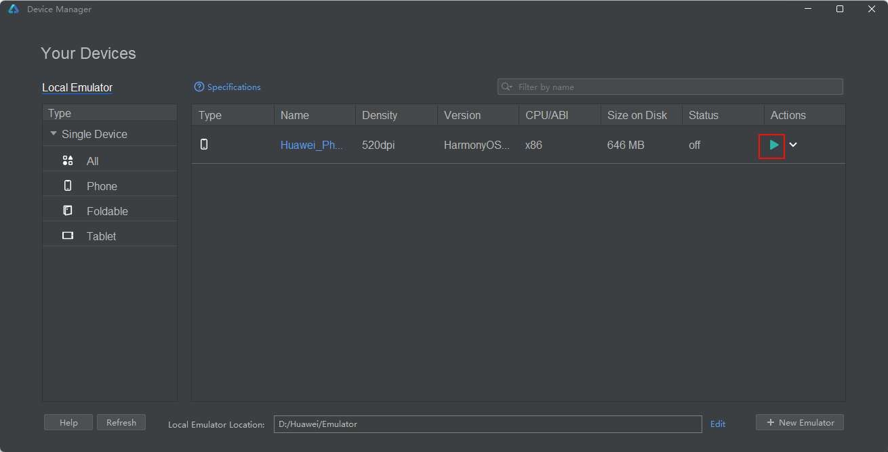
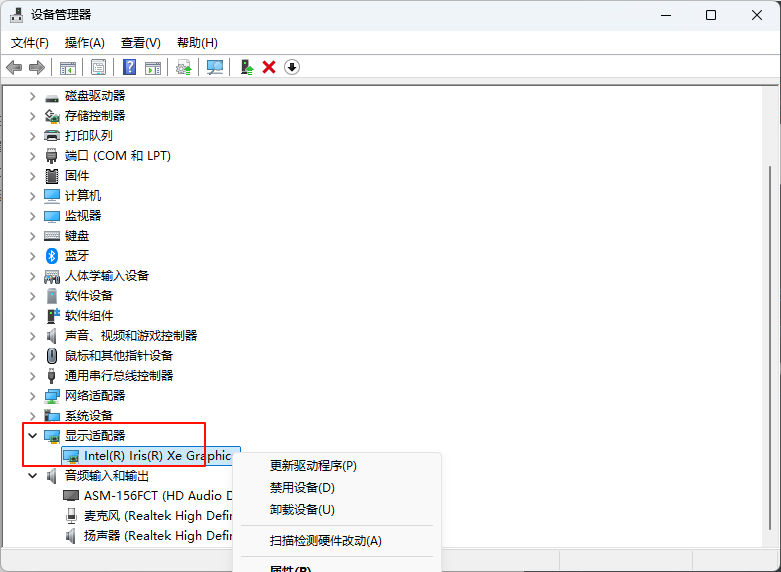

# 鸿蒙开发

## DevEco Studio

[下载地址](https://developer.huawei.com/consumer/cn/deveco-studio/)

### 安装SDK

菜单栏 File -> Settings

修改 SDK 安装目录，选择并安装 SDK

### 设备管理器

菜单栏 Tools -> Device Manage

- 打开设备管理器 Device Manage

- 登录 Huawei ID，首次使用根据引导申请开通权限

#### 添加设备

  - 配置模拟器的路径 Local Emulator Location
  - 点击添加模拟器 New Emulator
  - 配置镜像路径 Local Image Location
  - 下载镜像

#### 启动设备

::: info

如果启动后，提示显卡驱动版本过低，需要支持 OpenGL 4.1

检查显卡是否启用

:::

打开 **设备管理器**，展开显示适配器，在显卡上点击右键，检查是否要**启动设备**

### 运行项目

菜单栏 Run -> Run 'Entry'