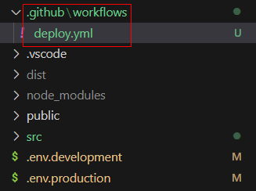
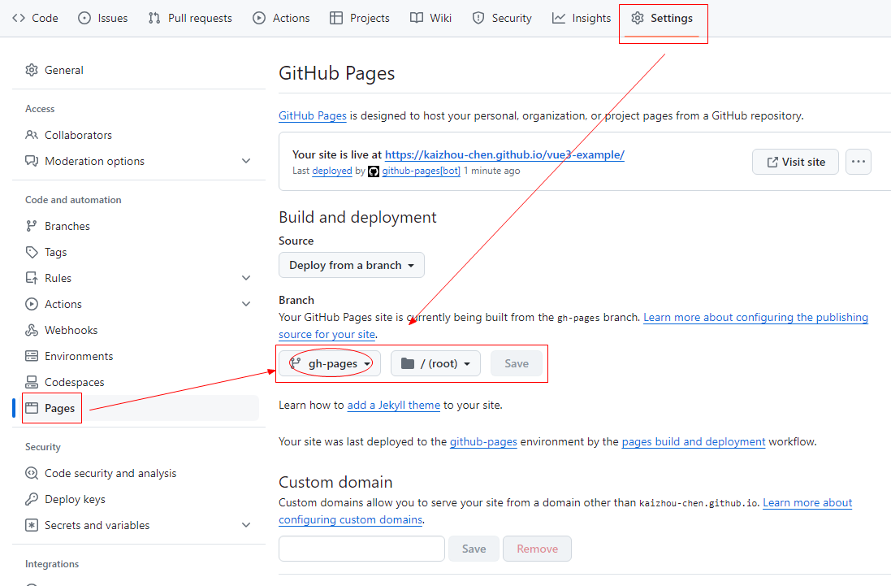

## 部署到 GitHub

使用 GitHub Actions 和 GitHub Pages 实现前端项目的自动构建与发布

GitHub Actions，自动打包部署

GitHub Pages，静态资源托管


## GitHub Actions

### 创建打包部署脚本

#### deploy.yml

在项目的根目录，新建文件夹 `.github` 及子文件夹 `workflows`

新建配置文件 `deploy.yml`



**deploy.yml**

```yaml
name: Build and Deploy

on:
  push:
    branches:
      - main # 推送到 main 分支时触发该命令

permissions:
  contents: write # 直接授权，不配置 GITHUB_TOKEN

jobs:
  build-and-deploy:
    runs-on: ubuntu-latest

    steps:
      - name: Checkout code
        uses: actions/checkout@v4
        with:
          ref: main # 拉取 main 分支代码

      - name: Setup Node.js and npm
        uses: actions/setup-node@v3
        with:
          node-version: '20.10.0' # 设置 nodejs 的版本

      - name: Install dependencies
        run: npm install # 使用 npm 安装依赖

      - name: Build
        run: npm run build:github # 执行打包命令

      - name: Deploy to GitHub Pages
        uses: JamesIves/github-pages-deploy-action@v4
        with:
          folder: dist # 指定要部署的文件夹为 dist
```


### gh-pages 分支

提交到代码仓后，会自动创建 `gh-pages` 分支


## GitHub Pages

选择  `gh-pages` 分支




## 部署后的问题

### 问题一

部署到 github 后，下划线开头的一个文件`_plugin-vue_export-helper`访问不到

#### 解决办法

**vite.config.js**

```js
import { defineConfig } from 'vite'
import vue from '@vitejs/plugin-vue'

// eslint-disable-next-line no-control-regex
const INVALID_CHAR_REGEX = /[\u0000-\u001F"#$&*+,:;<=>?[\]^`{|}\u007F]/g;
const DRIVE_LETTER_REGEX = /^[a-z]:/i;

export default defineConfig({
  build: {
    rollupOptions: {
      output: {
        // https://github.com/rollup/rollup/blob/master/src/utils/sanitizeFileName.ts
        sanitizeFileName(name) {
          const match = DRIVE_LETTER_REGEX.exec(name);
          const driveLetter = match ? match[0] : "";
          // A `:` is only allowed as part of a windows drive letter (ex: C:\foo)
          // Otherwise, avoid them because they can refer to NTFS alternate data streams.
          return (
            driveLetter +
            name.slice(driveLetter.length).replace(INVALID_CHAR_REGEX, "")
          );
        },
      },
    },
  },
});
```

参考文档： 

[打包部署到github后文件`_plugin-vue_export-helper`访问不到](https://blog.csdn.net/mouday/article/details/131612524)


### 关于 .gitignore

::: tip
dist 目录可能会在 .gitignore 文件里，在提交时被忽略掉

但是部署时，需要把 dist 目录提交到 `gh-pages` 分支，不能被忽略掉

所以需要再写一个打包命令，在打包时，覆盖掉 .gitignore 文件
:::

#### package.json

```js
{
  "scripts": {
    // 新的打包命令，添加参数 --deploy
    
    "build:github": "run-p type-check \"build-deploy {@}\" --",
    "build-deploy": "vite build --mode production -- --deploy"
  },
}
```

#### vite.config.ts

```js
{
  plugins: [
    vue(),

    // 自定义插件
    {
      name: 'copy-gitignore',
      writeBundle() {
        // 如果是部署到 github，则覆盖 .gitignore
        if (process.argv.includes('--deploy')) {
          const src = path.resolve(__dirname, '.bak/.gitignore');
          const dest = path.resolve(__dirname, '.gitignore');
          fs.copyFile(src, dest, () => {})
        }
      }
    }
  ],
}
```

在根目录下新建 `.bak` 文件夹，把 .gitignore 复制到里面，删除掉 dist。在打包时，用来覆盖 .gitignore