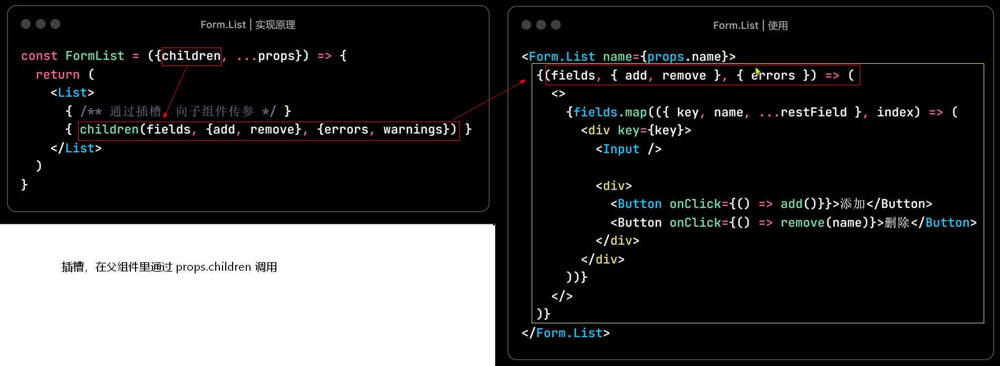

# Ant Design

## Form.Item

Form.Item 会向子组件的 props 传递 value、onChange

实现原理：

> 通过 React.cloneElement 复制子组件，在子组件的props 上添加 value、onChange

复制子组件，参考 [reactNode.ts](https://github.com/ant-design/ant-design/blob/master/components/_util/reactNode.ts)

## Form.List

Form.List 使用插槽，通过调用 props.children，向插槽内的子组件传参

实现原理：

## 其他

**Select 组件，支持全选**

- 使用 `Cascader` 组件，在 `dropdownRender` 里添加全选的选项
- 级联选择的多选，数据是二维数组，使用 `flat` 把数组扁平化

**Table  表头排序、筛选**

- `pagination` 分页相关配置
- `onChange` 分页、排序、过滤 发生变化

**Table  拖拽排序**

- 使用 `react-drag-listview` 进行拖拽
- 使用 **ahooks** 的 `useDynamicList` 实现动态表格

