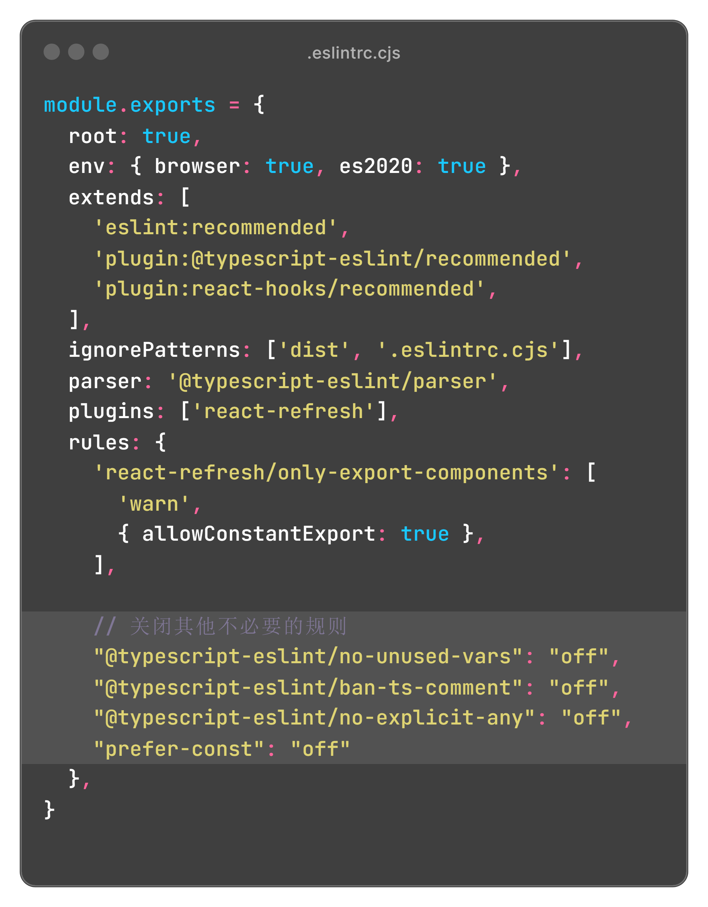

## 创建新项目

```bash
npm init vite@latest 项目名
```
### 对于 Vue 项目
选择 Vue、TypeScript

### 对于 React 项目
选择 React、TypeScript


#### 关闭不需要的规则

**.eslintrc.cjs**

```js
module.exports = {
  rules: {
  // 关闭其他不必要的规则
    "@typescript-eslint/no-unused-vars": "off",
    "@typescript-eslint/ban-ts-comment": "off",
    "@typescript-eslint/no-explicit-any": "off",
    "prefer-const": "off"
  },
}

```



## 安装依赖

```bash
npm install
```