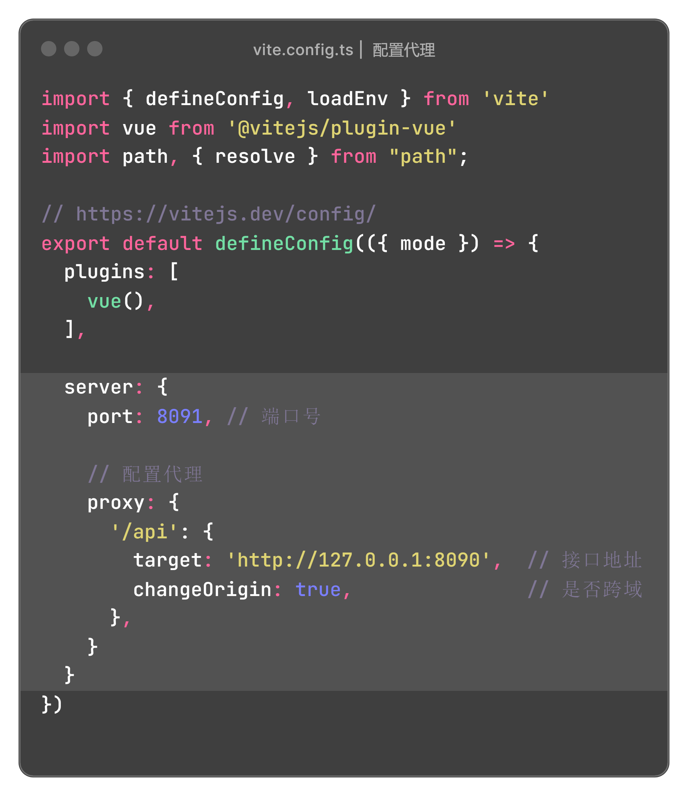

## 代理配置

**vite.config.ts**

```js
 server: {
    port: 8091, // 端口号

    proxy: {
        '/api': {
          target: 'http://127.0.0.1:8090',  // 接口地址
          changeOrigin: true,               // 是否跨域
        },
    }
 }
```

