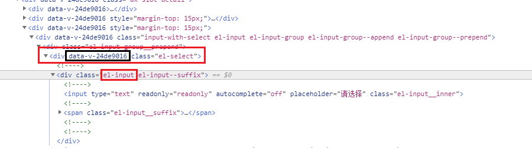

## 样式隔离 / 样式穿透

**样式隔离 scoped**

- scoped 样式只作用于当前组件，使组件之间的样式相互隔离，不会互相影响
- 在DOM结构和CSS样式上添加**唯一不重复的标记**: data-v-hash，以保证唯一，达到样式私有化的目的
- 如果组件内部包含有其他组件，只会子组件的根节点加上当前组件的data属性




**样式穿透 (深度选择器 deep)**

[官方文档](https://vue-loader.vuejs.org/zh/guide/scoped-css.html#深度作用选择器)，样式隔离后，如果需要修改全局样式，可以使用深度选择器。

例如

```html
<!--
Vue 2 推荐：/deep/
CSS 直接支持：>>>
-->

<!-- Vue 2 推荐 /deep/ -->
<style lang="less" scoped>
.el-select /deep/ .el-input {
    width: 130px;
}
</style>

<!-- CSS 直接使用 >>> -->
<style>
.el-select >>> .el-input {
    width: 130px;
}
</style>
```


## Less

**安装**

```bash
npm install --save-dev less less-loader
```


安装完成后，检查是否安装成功

在项目根目录执行如下命令

```bash
cd .\node_modules\.bin

.\lessc -v
```


**main.js**

```js
import less from 'less'
Vue.use(less)
```


**使用方法**

在 xx.vue 文件中，style标签上设置lang="less"

```html
<style lang="less" scoped>

</style>
```
