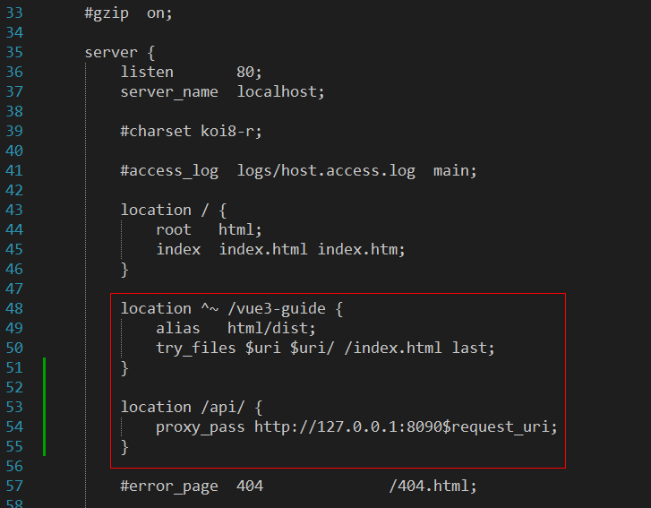

# 打包部署

## 静态资源

- assets 目录，需要用相对路径来访问 `./相对路径` 或者 `@/相对路径` 

  assets 目录下的文件，会被编译压缩，一般放全局的css文件、js文件，或代码相关的其他资源文件

- public 目录，需要用绝对路径来访问  `/绝对路径`

  public 目录下的文件，会被原封不动的复制到 dist 目录下，一般用来放第三方库，或者图片


## 部署到二级目录

如果要部署在域名的子目录下，需要设置项目的 base

比如部署在 http://www.xx.com/myapp/ ，则 base 为 /myapp/

具体配置参考 [4.3 项目的 base](#_43-项目的-base)

<br>

打包之后，检查 dist / index.html 里的 base 是不是 /myapp/


## 多入口配置

### 入口 html

在根目录新增入口 html，加载不同的 main.ts

如果把登录页面作为独立的入口，则访问 login.html 


### vite.config.ts

```js
import { defineConfig } from 'vite'
import vue from '@vitejs/plugin-vue'
import { resolve } from 'path'

export default defineConfig({

  build: {
    rollupOptions: {
      input: {
        main: resolve(__dirname, 'index.html'),
        login: resolve(__dirname, 'login.html')
      }
    }
  }

}
```


## 部署到 nginx

- 将打包后的 dist 文件夹，复制到 nginx 的 html 目录下

- 修改 conf / nginx.conf 配置文件

  a)  添加如下配置，其中访问地址，与上面的项目名称对应 【try_files 配置，是为了避免路由出错】

  ```nginx
  location ^~ /vue3-guide {
    alias   html/vue3-guide/dist;
    try_files $uri $uri/ /index.html last;
  }
  ```
  
  
  


- 修改了nginx 的配置文件后，需要到 nginx 的目录，打开cmd，执行如下命令来让改动生效
  `nginx -s reload`

