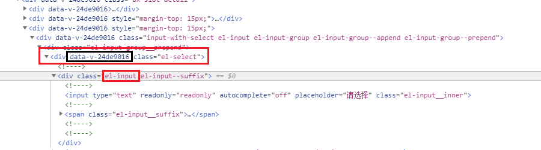

# CSS

## 样式隔离 scoped

- scoped 样式只作用于当前组件，使组件之间的样式相互隔离，不会互相影响
- 在DOM结构和CSS样式上添加**唯一不重复的标记**: data-v-hash，以保证唯一，达到样式私有化的目的
- 如果组件内部包含有其他组件，只会子组件的根节点加上当前组件的data属性




## 样式穿透 

### 深度选择器 deep

[官方文档](https://vue-loader.vuejs.org/zh/guide/scoped-css.html#深度作用选择器)，样式隔离后，如果需要修改全局样式，可以使用深度选择器。

```html
<!-- :deep() -->
<style lang="less" scoped>
.el-select :deep(.el-input) {
    width: 130px;
}
</style>
```


## Less

**安装**

```bash
npm install --save-dev less less-loader
```

```html
<style lang="less" scoped></style>
```


**自动注入 LESS 全局变量**

vite.config.js

```js
{  
  css: {
    // css预处理器
    preprocessorOptions: {
      less: {
        charset: false,
        // 在 additionalData 里配置全局变量
        additionalData: '@import "./src/assets/style/global.less";',
      },
    },
  }
}
```


