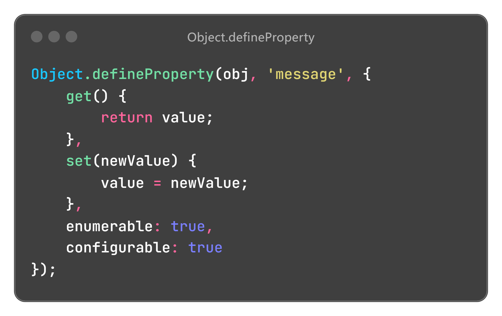
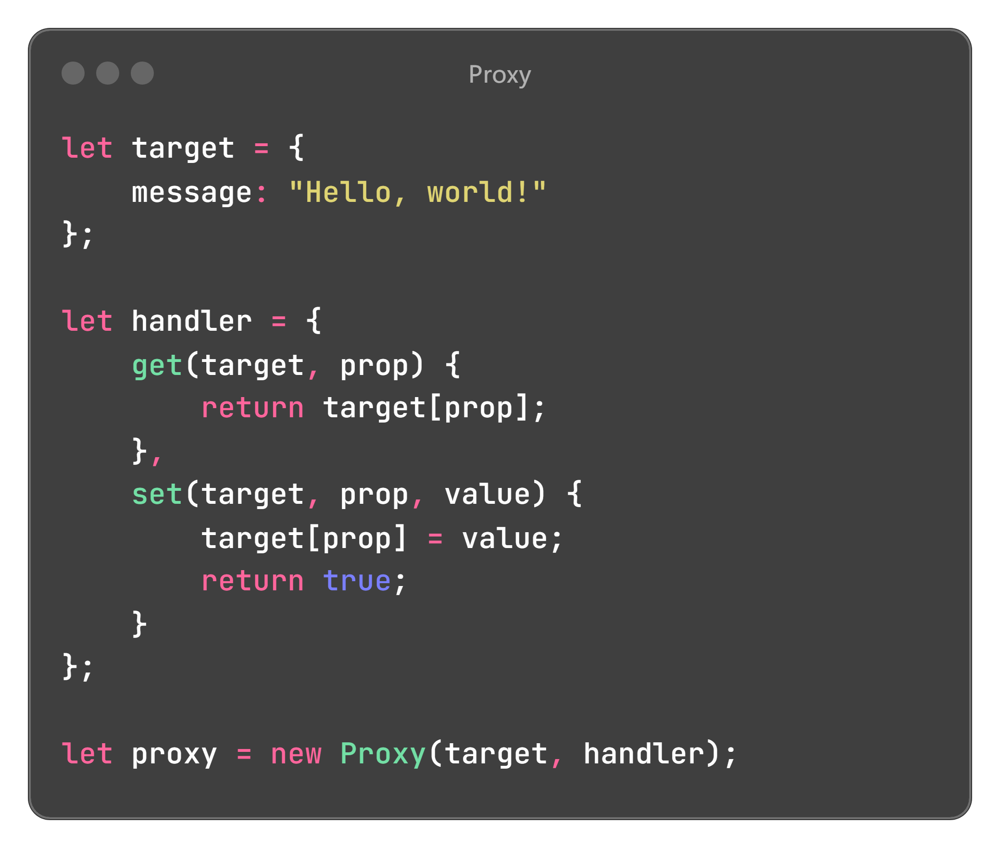
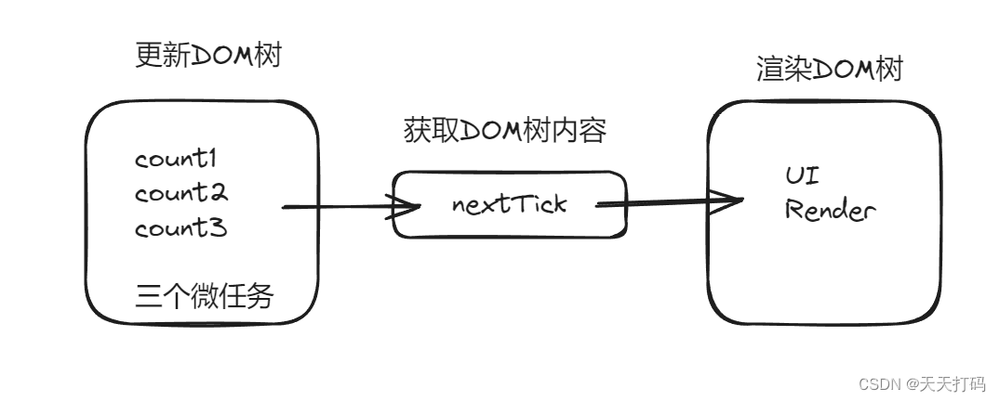

## 1、对 Vue 的理解

### 对 Vue 的理解

Vue 的核心特性是：数据驱动（MVVM）、组件化、指令系统。

组件化的优势：降低耦合度、支持复用、方便调试和维护

常用指令：条件渲染、列表渲染、属性绑定、事件绑定、双向数据绑定


### 对SPA (单页应用) 的理解

SPA（single-page application），翻译过来就是单页应用。通过动态重写当前页面来与用户交互，这种方法避免了页面之间切换打断用户体验。

单页应用的缺点是，首次渲染速度相对较慢。


#### 首屏加载

常见的几种SPA首屏优化方式

- 减小入口文件积

  在`vue-router`配置路由的时候，采用动态加载路由的形式

  ```js
  routes:[ 
      path: 'Blogs',
      name: 'ShowBlogs',
      component: () => import('./components/ShowBlogs.vue')
  ]
  ```

- UI框架按需加载

  在日常使用`UI`框架，例如`element-UI`、或者`antd`，我们经常性直接引用整个`UI`库。可以按需引用。

- 图片资源的压缩

  对页面上使用到的`icon`，可以使用在线字体图标，或者将众多小图标合并到同一张图上，用以减轻`http`请求压力。

- 开启GZip压缩

  打完包之后，可以用`gzip`做一下压缩。在服务器上也要做相应的配置，如果发送请求的浏览器支持`gzip`，就发送给它`gzip`格式的文件。


## 2、Vue 如何实现数据双向绑定

Vue 是通过**数据劫持**的方式来做数据绑定的。Vue 2 使用的核心方法是 `Object.defineProperty()`，Vue 3 使用的是代理 Proxy。

### 数据劫持

| 数据劫持         | Vue 2                                                        | Vue 3                                        |
| ---------------- | ------------------------------------------------------------ | -------------------------------------------- |
| 核心方法         | Object.defineProperty                                        | Proxy                                        |
| 收集依赖         | 视图中会用到`data`中某`key`，这称为依赖<br>同⼀个`key`可能出现多次，每次都需要收集出来<br>用⼀个`Watcher`来维护它们 | `get` 读取属性时，将当前副作用函数添加到桶里 |
| `set` 设置属性后 | 通知所有的订阅者执行更新                                     | 把副作用函数从桶里取出并执行                 |

### 区别

|  | Object.defineProperty | Proxy                                       |
| ---------------------------- | -------------------------------------------------------- | ---------------------------- |
| 拦截范围 | 只能拦截对象的`单个属性`操作<br>只能定义特定属性的 getter 和 setter | 可以拦截对`对象的所有操作`<br>包括属性访问、赋值、删除、函数调用等<br>可以使用get、set、deleteProperty等来拦截这些操作 |
| 动态属性 | 不可以处理动态属性<br>使用 `$set` 、`$delete` | 可以处理对象的动态添加和删除属性 |
| 性能 | 需要遍历所有属性<br>必须深层遍历嵌套的对象<br>会改变原对象，将原本的 value 变成了 setter 和 getter | 不用遍历<br>可以在 get 里面递归调用 Proxy 并返回<br>不改变原对象，生成一个代理对象 |
|  |  |  |

Vue 2 无法**直接**监听到属性的新增与删除，需要通过 `$set` 和 `$delete` 来实现。由于不能监听到数组的变化，所有内部重写了数组的相关方法。


## 3、Vue 如何实现nextTick

Vue 会在数据变化后异步执行 DOM 更新。在更新完毕后，会调用 nextTick。

异步更新其实是微任务，nextTick 也优先使用微任务 Promise

```js
const p = Promise.resolve()
p.then(flushCallbacks)
```

### 更新 ≠ 渲染

nextTick 是微任务，此时页面没有重新渲染，为什么能获取到最新DOM呢？很重要的一点是：更新 ≠ 渲染

因为异步更新，已经修改了DOM树，可以获取到最新的DOM，只是还没渲染到页面上而已。

